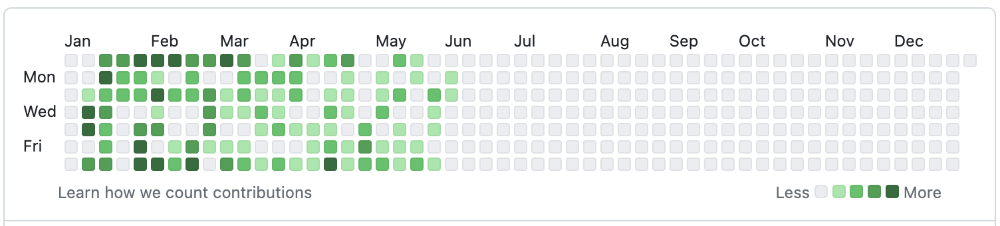

 

대학교 졸업 후 숨 가쁘게 첫 직장에 취업을 했었고 시간이 지나 벌써 2년 차 프런트엔드 엔지니어가 되었습니다. 초반엔 첫 회사생활에 적응하느라 급급해서 지나쳤지만 점점 일에 익숙해지면서 스스로를 돌아볼 시간들이 생기기 시작했습니다. 물론 대학과정에서 한 번도 배우지 못했던 많은 경험을 쌓았고 지식을 배웠지만 회사일을 하면서 아직은 많이 부족하다는 걸 느꼈습니다.

 

 

2023년 초반이었을 겁니다. 일을 하면서 배울 수 있는 건 <b> 한계</b>가 있다는 걸 알게 되었고 <b> 자기 개발</b>이 절실히 필요하다는 걸 느꼈었고 <b> 변화</b>가 필요하다고 생각을 했었습니다. 그때쯤부터 하루에 작게는 3시간에서 길게는 5시간씩 개인 프로젝트를 하며 지금까지 꾸준히 배워왔습니다. 하지만 누가 검사하는 게 아닌 혼자만의 의지로 하는 거라서 그랬을까요. 가끔씩은 조금 나태해져 며칠을 하지 않은 적도 있고 미룬 적들도 있습니다. 이런 저를 스스로 돌아봤을 때 지금이 조금은 자신에게 엄격해져야 할 시점이라고 생각했습니다.

 

## **부지런한 농부가 되어보자.**

그 시작으로 요즘 개발자들이 많이 한다는 1일 1 잔디 계획을 실천해보려고 합니다. 흔히 `일일커밋`이라고도 많이 하는데요. 이러한 기준점과 목표가 저에겐 큰 동기부여와 자극이 되어 저를 조금 더 부지런한 개발자로 만들어 줄 수 있지 않을까 하는 기대감이 있습니다. 또한 이 일이 계기가 되어 개발자에게 무엇보다 중요한 꾸준히 공부하는 습관을 기르고 싶습니다. 빼곡히 심어진 잔디들을 시각적으로 확인함과 동시에 이룬 것, 해왔던 것, 내가 잘하는 것과 부족한 것들을 수시로 확인하고 개선해 나아갈 수 있을 것입니다.

 

## **어떤 잔디를 심을 것인가?**

사실상 잔디를 심는다는 것도 중요하지만 그것보다 더 중요한 건 뭘 심을까인데요. 저는 일일커밋을 위해서 공부하려고 하지 않을 것입니다. 단순히 초록색으로 하나의 네모칸을 채우는 식으로만 했을 땐 저에겐 남는 것이 하나도 없다는 걸 누구보다 잘 알고 있기 때문입니다.

올해 초부터 지금까지 꾸준히 공부를 해왔고 어느 정도의 기록하는 습관과 개발공부가 이젠 일상이 된 지금 충분히 억지로가 아닌 자연스럽게 일일커밋을 할 수 있다는 자신이 있습니다. 지금까지 해왔던 것처럼 새로운 지식이나 제 고민이 담긴 코드들을 커밋에 담고 일일커밋이라는 목표는 단순히 조금 더 부지런해지기 위한 수단으로 사용할 것입니다.

저는 <b>"이런 잔디"</b>의 종류를 심겠습니다.

- 새로운 장르나 기본기에 대한 공부 및 정리 한 내용들
- 블로그 글 작성
- 평소에 구현해보고 싶었던 기능을 포함한 개인 프로젝트
- 알고리즘 (코딩테스트)

 

흔적을 남기고 기록을 남기면서 한 층 한 층 성장하는 게 눈의 띄는 사람이 되도록, 그리고 그 과정을 즐기면서 할 줄 아는 사람이 되도록 꾸준히 노력할 것 입니다.
