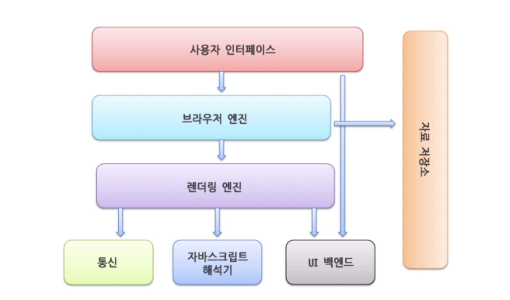
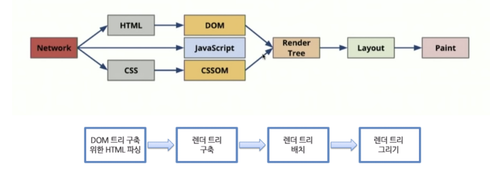
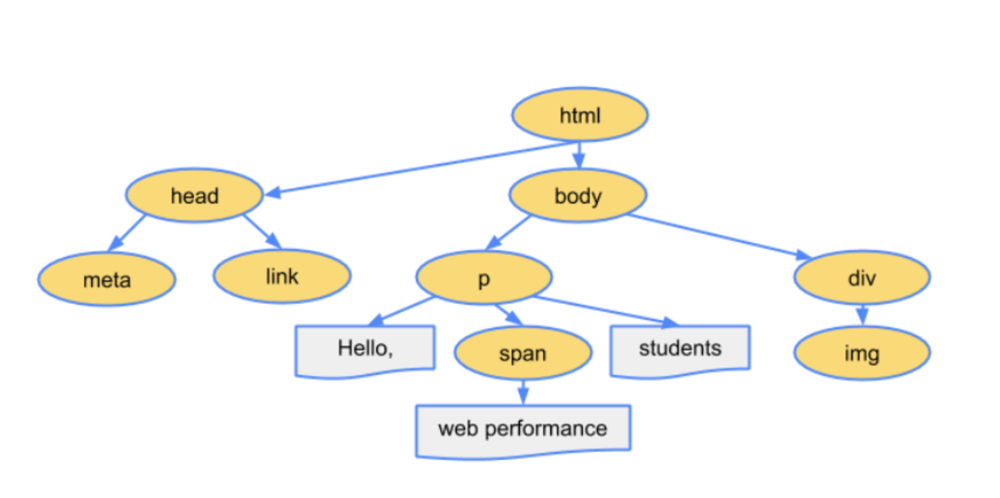
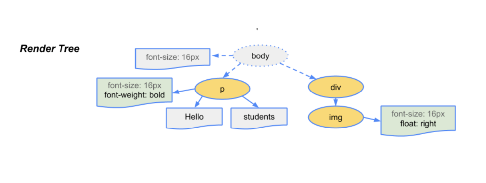

</br>

## 브라우저

```
1. 사용자가 브라우저를 실행한다.
2. 접속하고 싶은 사이트의 url를 주소창에 입력한다
3. 브라우저는 입력된 url의 서버에게 사이트 정보를 받아와 이를 화면에 표현한다.
4. 표현된 정보를 사용자가 활용한다.
```

</br>

## 기본 구조

<div style="width:100%; margin:auto;">



</div>

**사용자 인터페이스** : 주소 표시줄, 이전/다음 버튼, 북마크 메뉴, 새로고침, 홈버튼 등 요청한 페이지를 보여주는 창을 제외한 나머 지 모든 부분.

**브라우저 엔진** : 사용자 인터페이스와 렌더링 엔진 사이의 동작을 제어

**렌더링 엔진** : 요청한 콘테츠를 표시. 예를 들면 HTML을 요청하면 HTML과 CSS를 파싱 하여 화면에 표시한다.

**통신**: HTTP요청과 같은 네트워크 호출에 사용됨. 이것은 플랫폼 독립적인 인터페이스이고 각 플랫폼 하부에서 실행된다.

**UI 백엔드** : 콤보 박스와 창 같은 기본적인 장치를 그린다. 플랫폼에서 명시하지 않은 일반적인 인터페이스로, OS사용자 인터페이스 체계를 사용.

**자바스크립트 해석기** : 자바스크립트 코드를 해석하고 실행.

**자료 저장소** : 자료를 저장. 쿠키를 저장하는 것과 같이 모든 종류의 자원을 하드 디스크에 저장할 필요가 있다. HTML5 명세에는 브라우저가 지원하는 웹데이터 베이스가 정의되어 있다.

여기서 랜더링 엔진이 큰 역할을 하는데 렌더링 엔진의 역할은 요청받은 내용을 브라우저 화면에 표시하는 일이다.

</br>

## 렌더링 과정

<div style="width:100%; margin:auto;">



</div>

**불러오기 (loading)** : HTTP 모듈 또는 파일 시스템으로 전달받은 리소스 스트림을 읽는 과정으로 로더가 이 역할을 맡고 있다. 로더는 단순히 읽는 것이 아니라, 이미 데이터를 읽었는지도 확인하고, 팝업창을 열지 말지, 또는 파일 다운로드할지를 결정한다.

**다운로드한 HTML, CSS를 Object Model로 만든다 (DOM, CSSOM생성)**:

<div style="width:100%; margin:auto;">



</div>

- DOM (Document Object Model) : HTML태그를 JS에서 이용할 수 있는 객체로 만드는 것이다. 즉 HTML문서의 객체 기반 표현 방식이다. HTML은 DOM으로 : HTML파일은 HTML파서에 의해 파싱 되어 DOM트리로 변환된다.

<div style="width:100%; margin:auto;">


</div>

- CSS는 CSSOM으로 : CSS파일은 CSS파서에 의해 파싱 되어 CSSOM트리로 변환된다. 파싱이란? : 문서를 파싱 한다는 것은 브라우저가 코드를 이해하고 사용할 수 있는 구조로 변환하는 것이다. 파싱 결과는 보통 문서 구조를 나타내는 노드 트리인데 파싱 트리 또는 문법 트리라고 부른다.

**Render Tree생성** : DOM과 CSSOM을 합치며 Render tree를 만든다. 렌더트리에는 스타일 정보가 설정되어 있고, 실제 화면에 표현되는 노드들로 구성된다.

<div style="width:100%; margin:auto;">



</div>

**Layout** : 브라우저의 뷰포트(Viewport) 내에서 각 노드들의 정확한 위치와 크기를 계산한다. 생성된 Render Tree 노드들이 가지고 있는 스타일과 속성에 따라서 브라우저 화면의 어느 위치에 어느 크기로 출력될지 계산하는 단계이다.(reflow 단계) 레이아웃 단계에서 %, vh, vw와 같이 상대적인 위치, 크기 속성은 실제 화면에 그려지는 픽셀 단위로 변환된다. ViewPort : 그래픽이 표시되는 브라우저 영역, 크기. 뷰포트는 모바일의 경우 디스플레이의 크기, pc의 경우 브라우저 창의 크기에 따라 달라진다.

**Paint** : Layout 계산이 완료되면 이제 요소들을 실제 화면을 그리게 된다. (repaint 단계) 처리해야 하는 스타일이 복잡할수록 paint 단계에 소요되는 시간이 길다. (가령 그러데이션, 그림자 효과 > 단색 배경)
