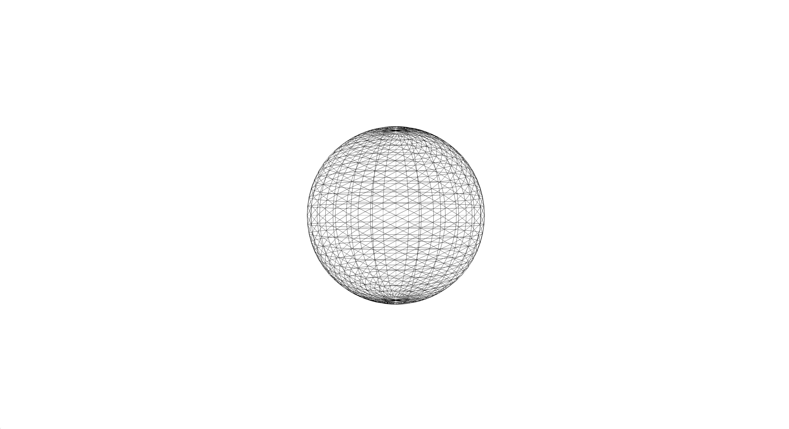
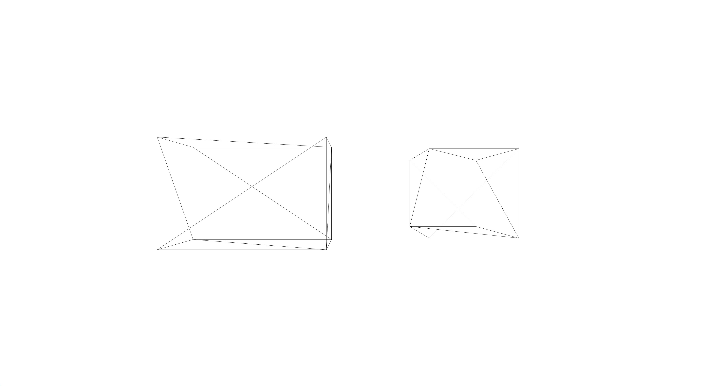
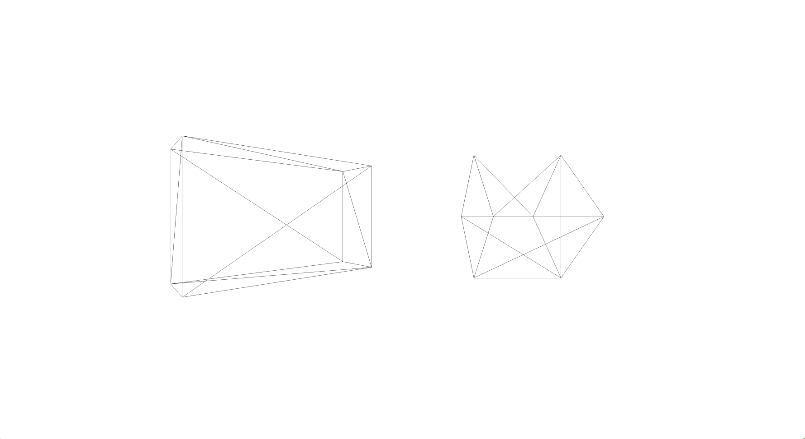
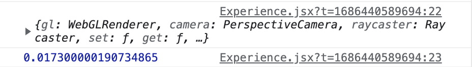

<br/>

깃헙 코드 : https://github.com/soheee-bae/React-Three-Fiber/tree/main/basic

## Setup

```jsx
npm install three @types/three @react-three/fiber
```

여기서 집중해서 봐야 할 것은 `@react-three/fiber` 앞에 `@`이라는 기호가 붙어있다는 건데요. 이 뜻은 `react-three`라는 더 큰 시스템의 일부에서 `/fiber`이라는 일부를 사용하려 한다는 걸 의미합니다. 여기서 하나 더 알 수 있는 건 `/fiber`이 아닌 다른 일부들도 존재한다는 겁니다. 이 글에서는 /fiber에 대한 글을 정리해서 적어보려고 합니다.

<br/>

## 기본적인 Scene 만들기

제일 기본 중에 기본인 `scene`을 만드는 것은 아주 간단합니다.

1. `canvas` 만들기
2. `mesh`안에 `geometry`과 `material`을 넣어주기

```
const root = ReactDOM.createRoot(document.querySelector("#root"));
root.render(
        <Canvas>
            <mesh>
                <sphereGeometry />
                <meshBasicMaterial />
            </mesh>
        </Canvas>
)
```

<br/>

## Resizing

기본적으로 `canvas`는 부모 컴포넌트 사이즈를 따라갑니다. 위의 코드에서 부모 컴포넌트는 `#root`인데요. 이것을 바꾸기 위해서는 css를 사용하여 #root, body, html 사이즈를 동일하게 만들어 #root의 뷰포트를 늘림과 동시에 사이즈를 조절할 수 있습니다.

```
html,
body,
#root
{
    position: fixed;
    top: 0;
    left: 0;
    width: 100%;
    height: 100%;
    overflow: hidden;
}
```

<br/>

## Mesh 더 알아보기

React Three Fiber을 사용해서 mesh를 구현할 때 무엇보다 중요한 건 Three.js 문서를 잘 활용하면서 사용하는 방법 아는 것이라고 생각합니다. 많은 `geometry`, `material` 및 기타 구성 요소들은 Three.js에서 그대로 가져와서 React Three Fiber에서 쓰이기 때문에 3D개발을 할 때 유용하게 쓰일 수 있는 정보들이 많습니다.

<br/>

### Geometry (형상)

React Three Fiber은 모든 `geometry`에 기본 매개변수를 제공합니다. 하지만 만약 그 값을 바꾸고 싶거나 바꾸어야 하는 상황이 온다면 geometry의 자세한 정보나 사용가능한 매개변수를 보기 위해서 저는 Three.js의 [Geometries](https://threejs.org/docs/#api/ko/geometries/SphereGeometry "Geometries") 사이트를 이용합니다.

여기서 `sphereGeometry`의 첫 세 개의 매개변수를 확인할 수 있습니다.

- radius
- widthSegments
- heightSegments

이 매개변수에 값을 주려면 `args` 속성에 array 형태로 값을 지정해 주면 사용할 수 있습니다. `args` 속성에 보내는 값의 순서는 항상 Three.js 클래스와 동일한 순서입니다.

```
<mesh>
    <sphereGeometry args={ [ 1.5, 32, 32 ] } />
    <meshBasicMaterial />
</mesh>
```

<br/>

### Material (재질)

위의 geometry과 비슷합니다. 만약 `meshBasicMaterial`에 기능을 추가하고 싶다면 위와 같이 Three.js의 [Materials](https://threejs.org/docs/?q=mate#api/ko/constants/Materials "Materials") 사이트를 이용하시면 됩니다.

여기서 geometry과 조금 다른 점은 `object` 형태인 하나의 매개변수만 필요로 하고 있다는 겁니다. 이럴 경우 물론 `object`로 보내서 값을 변경할 수 있겠지만, 더 나은 방법으로 해당 특성을 사용하여 속성을 직접 설정하는 방법도 있습니다.

```
<meshBasicMaterial args={ [ { ... } ] } />  // object로

<mesh> // 더 좋은 방법
    <sphereGeometry args={[1.5, 32, 32]} />
    <meshBasicMaterial color="black" wireframe />
 </mesh>
```

wireframe과 색을 검정색으로 정해주면 밑과 같은 화면이 나옵니다.

<div style="width:100%; margin:auto;">



</div>

<br/>

### Mesh

더 나아가서 mesh 자체에 `scale(스케일)`, `position(위치)` 및 `rotation(회전)` 설정을 해줄 수도 있습니다.

**Scale (스케일)**

```
<mesh scale={[3, 2, 1]}>.  //x, y, z 를 다른값으로 주고 싶을때
        <boxGeometry />
        <meshBasicMaterial color="black" wireframe />
</mesh>

<mesh scale={1.5}>   // x,y,z에 같은 값을 주고 싶을때
        <boxGeometry />
        <meshBasicMaterial color="black" wireframe />
</mesh>
```

**Position (위치)**

```
<>
      <mesh position={[-2, 0, 0]} scale={[3, 2, 1]}>
        <boxGeometry />
        <meshBasicMaterial color="black" wireframe />
      </mesh>
      <mesh position={[2, 0, 0]} scale={1.5}>
        <boxGeometry />
        <meshBasicMaterial color="black" wireframe />
      </mesh>
</>

<mesh position-x={2} scale={1.5}>  // x-axis에만 position을 설정할때
<mesh position-x="2" scale={1.5}>  // { } 없이 x-axis에만 position을 설정할때
```

<div style="width:100%; margin:auto;">



</div>

**Rotation (회전)**

```
<mesh rotation-y={Math.PI * 0.25} position={[-2, 0, 0]} scale={[3, 2, 1]}>
    <boxGeometry />
    <meshBasicMaterial color="black" wireframe />
</mesh>
<mesh rotation-x={Math.PI * 0.25} position={[2, 0, 0]} scale={1.5}>
    <boxGeometry />
    <meshBasicMaterial color="black" wireframe />
</mesh>
```

<div style="width:100%; margin:auto;">



</div>

</br>

## 애니메이션

물론 장면을 만드는 것도 좋지만 3D개발에서 애니메이션이 빠지면 안 되죠. `scene(장면)`은 이미 각 프레임에 그려지고 있지만 아무것도 움직이지 않기 때문에 애니메이션 없이는 시각적으로 보이지 않습니다.

Mesh를 회전시키거나 움직임을 주기 위해서는 `useFrame`이라는 hook을 사용해야 하고 이 hook은 `<canvas>` 내부에 있는 구성요소에서만 호출할 수 있습니다.

여기서 문제점은 장치의 프레임 속도가 더 높으면 높을수록 `useFrame`은 더 높은 빈도로 호출되고 애니메이션의 속도는 더 빨라지게 됩니다. 이 말은 즉슨 개개인이 쓰는 장치의 프레임 속도에 따라 애니메이션 속도가 다르게 보일 수 있다는 것입니다. 물론 작은 프로젝트에서는 문제가 없겠지만 하루에 많은 사람들이 접속하는 웹 사이트라면 문제가 되겠죠.

장치 프레임 속도에 상관없이 동일한 애니메이션 속도를 보여주기 위해서 `useFrame`이 제공하는 `state`과 `delta`를 사용할 수 있습니다. 마지막 프레임 이후 경과된 시간을 알아내서 애니메이션 효과에 적용을 함으로써 문제를 해결할 수 있습니다.

<div style="width:100%; margin:auto;">



</div>

- state: 카메라, 렌더러, 장면 등과 같은 three.js환경에 대한 정보가 포함되어 있습니다.
- delta: 마지막 프레임 이후 소요된 시간을 초단위로 나타냅니다.

```
// index.jsx
import Experience from "./Experience";

const root = ReactDOM.createRoot(document.querySelector("#root"));

root.render(
  <Canvas>
    <Experience />
  </Canvas>
);

//Experience.jsx
import { useFrame } from "@react-three/fiber";
import { useRef } from "react";

export default function Experience() {
    const cubeRef = useRef();
    useFrame((state, delta) => {
        cubeRef.current.rotation.y += delta;
        또는 cubeRef.current.rotation.y += 0.01;
    });

  return (
    <>
        <mesh
            ref={cubeRef}
            rotation-y={Math.PI * 0.25}
            position-x={0}
            scale={1.5}>
            <boxGeometry />
            <meshBasicMaterial color="mediumpurple" />
        </mesh>
        <mesh position-y={-1} rotation-x={-Math.PI * 0.5} scale={10}>
            <planeGeometry />
            <meshBasicMaterial color="greenyellow" />
        </mesh>
	</>
  );
}
```

위의 코드를 실행하면 밑과 같은 애니메이션이 적용됩니다.

<video src="../../assets/videos/r3f/r3f-singleRotation.mp4"  controls="controls" style="width:100%"></video>

</br>

## Group

Three.js에도 [Group](https://threejs.org/docs/#api/en/objects/Group "Group")이 있듯이 React Three fiber에도 있습니다. `Group`이라는 것은 react의 `div`와 비슷합니다. 컴포넌트들을 div를 통해 나누는 것처럼 `group`은 개체들을 그룹으로 나누어 더 명확하게 볼 수 있고 더 나아가 각각의 개체가 아닌 그룹을 기준으로 애니메이션 효과를 줄 수 있게 도와줍니다.

그룹을 기준으로 한 애니메이션 효과를 주는 방법은 이와 같습니다.

**1. mesh들을 group으로 감싸준다.**

```
<group ref={ groupRef }>
    <mesh position-x={ - 2 }>
        <sphereGeometry />
        <meshBasicMaterial color="orange" />
    </mesh>
    <mesh rotation-y={ Math.PI * 0.25 } position-x={ 2 } scale={ 1.5 }>
        <boxGeometry />
        <meshBasicMaterial color="mediumpurple" />
    </mesh>
</group>
```

**2. group을 위한 useRef를 만들어 group 태그에 지정해 준다.**

```
export default function Experience(){
const groupRef = useRef()
return (
    <group ref={ groupRef }>
    // ...
    )
}
```

**3. useFrame에 애니메이션을 적용해 준다.**

```
useFrame((state, delta) => {
    groupRef.current.rotation.y += delta
})
```

위의 코드를 실행하면 밑과 같은 애니메이션이 적용됩니다.

<video src="../../assets/videos/r3f/r3f-groupRotation.mp4" controls="controls" style="width:100%">
</video>
