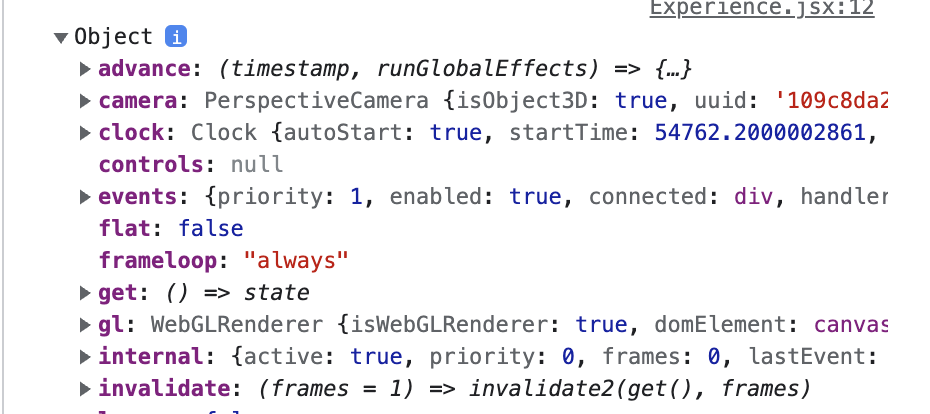
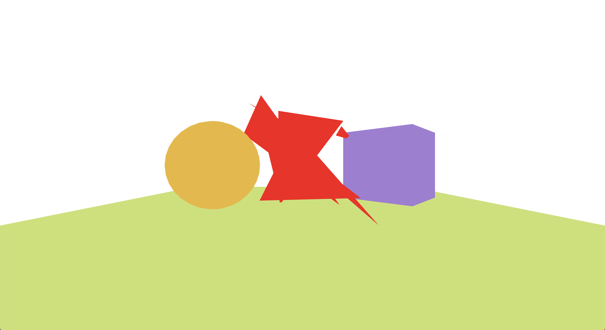
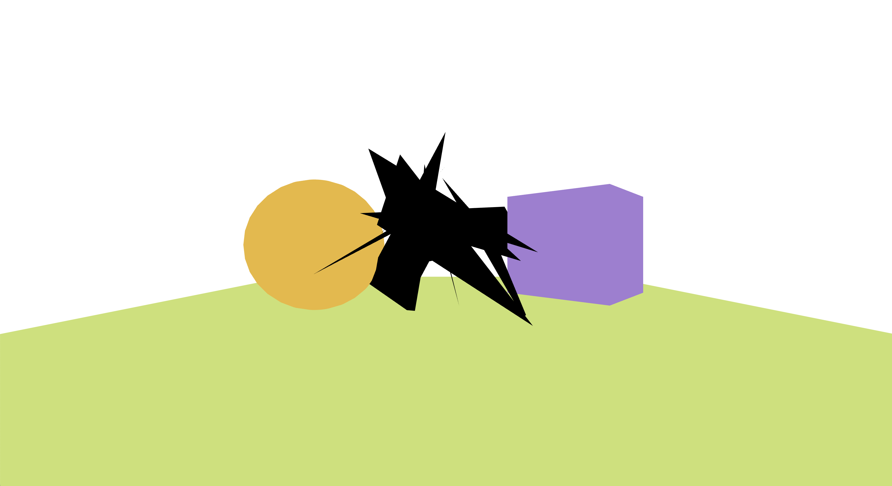

</br>

## OrbitControls (궤도 컨드롤)

`OrbitControls`를 추가하게 되면 카메라를 회전시켜 여러 시각으로 장면을 볼 수 있습니다. `OrbitControls`는 Three.js 클래스의 일부가 아니기에 직접 jsx 파일에서 사용할 수 있도록 React Three Fiber에서 제공하는 `extend`를 사용해서 변환시켜줘야 합니다.

```
import { OrbitControls } from 'three/examples/jsm/controls/OrbitControls.js'
import { extend, useFrame } from '@react-three/fiber'

extend({ OrbitControls })
```

[OrbitControls](https://threejs.org/docs/#examples/ko/controls/OrbitControls "OrbitControls")를 사용할 때 필수인 두 개의 매개변수가 있는데요. 이는 위의 글에서 봤었던 `useFrame`의 `state`과 같은 값을 주는 `useThree`에서 가져와 지정해 줄 수 있습니다.

<div style="width:100%; margin:auto; text-align:center;">



##### useThree()의 값

</div>

```
import { useThree, extend, useFrame } from '@react-three/fiber'

export default function Experience(){
    const { camera, gl } = useThree()
    return
        <>
            <orbitControls args={ [ camera, gl.domElement ] } />
            {/* ... */}
        </>
}
```

위의 코드를 실행하면 밑과 같은 기능이 적용됩니다.

<video src="../../assets/videos/r3f/r3f-orbitcontrols.mp4" controls="controls" style="width:100%"></video>

</br>

## Light (빛)

3D개발에서 현실감을 주기 위해서 빛은 장면에서 꼭 필요한 요소 중의 하나입니다. 여기서 중요한 건 개체가 빛에 반응을 하려면 `<meshBasicMaterial>` 재질이 아닌 `<meshStandardMaterial>` 재질을 써야 한다는 점입니다.

빛에도 여러 종류가 있는데요. 대표적으로 `<directionalLight>`과 `<ambientLight>`가 있으며 빛의 위치나 강도 등을 조절할 수 있습니다.

```
export default function Experience(){
    // ...
    return
        <>
            <directionalLight position={ [ 1, 2, 3 ] } intensity={ 1.5 } />
            <ambientLight intensity={ 0.5 } />
            {/* ... */}
        </>
}
```

</br>

## 내 맘대로 형상 만들기

지금까지 Three.js와 React Three Fiber이 제공하는 `geometry(형상)`을 사용했었는데요. 물론 제공되는 형상들을 사용할 수도 있지만 직접 원하는 형상을 만들어서 사용할 수 도 있습니다.

</br>

**준비단계**

모든 형상은 3개의 꼭짓점으로 만들어진 삼각형들이 모여 이루어져 있는데요. 우선 원하는 형상을 만들기 위해서는 꼭짓점의 수를 계산해 주고 `Float32Array`를 이용해서 각 꼭짓점들의 위치를 `array` 형태로 저장해주어야 합니다.

```
export default function CustomObject()
{
  const verticesCount = 10 * 3 // 10개의 삼각형과 각각 3개의 꼭짓점
  const positions = useMemo(() => {
    const positions = new Float32Array(verticesCount * 3)
    // verticesCount에 3을 곱하는 이유는 하나의 점당 3개의 값이 필요하기 때문입니다 (x,y,z)

    //for loop을 이용해 랜덤 값을 array에 넣어줍니다.
    for(let i = 0; i < verticesCount * 3; i++)
        positions[i] = (Math.random() - 0.5) * 3
        return positions
    })
    // ...
}
```

</br>

**위치 속성을 이용해서 형상 만들기 (+[BufferGeometry](https://threejs.org/docs/#api/ko/core/BufferGeometry "BufferGeometry")과 [BufferAttribute](https://threejs.org/docs/#api/ko/core/BufferAttribute "BufferAttribute"))**

위에서 만들었던 꼭짓점들의 위치들을 가지고 있는 array를 `BufferAttribute`를 통해 `BufferGeometry`에 속성을 포함시키면 그 속성을 가진 하나의 형상을 만들 수 있습니다.

여기서 제일 중요한 건 `BufferAttribute`에 어떤 속성을 포함시키고 싶은지를 알려줘야 하는데요. 이는 `attach`를 사용해서 알려줄 수 있습니다.

> 💡 위치 속성은 많은 속성 중 하나입니다. 이 외에도 color, normal, uv, uv2 등과 같은 속성들이 있습니다.

```
<bufferGeometry>
    <bufferAttribute
        attach="attributes-position" // geometry.attribute.position과 같습니다
        count={ verticesCount } //꼭짓점 갯수
        itemSize={ 3 } // array에서 하나의 꼭짓점을 구성하는 항목의 수
        array={ positions } // 꼭짓점들의 위치들을 가지고 있는 array
    />
</bufferGeometry>
```

위의 코드를 실행하면 밑과 같은 형상이 만들어집니다.

<div style="width:100%; margin:auto;">



</div>

</br>

**Double Side 측면 렌더링 하기**

기본값으로 위의 형상을 만들었을 때 앞면만 렌더링이 됩니다. 나중에 `orbitControl`를 사용해 형상의 모든 면을 다 볼 때를 대비해서 `Double side` (앞뒤 둘 다) 측면을 렌더링 하는 것을 추천합니다.

```
import * as THREE from 'three' 또는 import { DoubleSide } from 'three'
<meshBasicMaterial color="red" side={ THREE.DoubleSide } />
```

</br>

**computeVertexNormals을 이용해서 normal 속성 포함시키기**

만든 형상이 빛에 반응하게 하기 위해서는 `<meshBasicMaterial>` 재질이 아닌 `<meshStandardMaterial>` 재질을 사용해야 합니다.

```
<mesh>
    <meshStandardMaterial color="red" side={ THREE.DoubleSide } />
</mesh>
```

위의 코드를 실행하면 밑과 같은 화면이 나오는데요. 만든 형상에 색을 제대로 입히기 위해서 `normal` 속성을 포함시켜줘야 합니다. 쉬운 방법으로 `computeVertexNormals`를 사용해 포함시키는 방법이 있습니다.

<div style="width:100%; margin:auto;">



</div>

```
import { useRef, useMemo } from 'react'

export default function CustomObject(){
    const geometryRef = useRef()
    const positions = useMemo(() => {
        // ...
    })

    // positions가 렌더링 될때마다 불러옵니다.
    useEffect(() => {
        geometryRef.current.computeVertexNormals()
    }, [ positions ])
    // ...
    <bufferGeometry ref={ geometryRef }>
        {/* ... */}
    </bufferGeometry>
}
```

위의 코드를 실행하면 밑과 같은 화면처럼 만든 형상에 빛에 반응하는 재질이 적용됩니다.

<video src="../../assets/videos/r3f/rf3-doubleSide.mp4" controls="controls" style="width:100%"></video>

</br>

## Camera 설정하기

**기본 Camera**

캔버스에 기본값으로 [PerspectiveCamera](https://threejs.org/docs/?q=camera#api/ko/cameras/PerspectiveCamera "PerspectiveCamera")를 설정해 줄 수 있습니다. `PerspectiveCamera`는 사람의 눈으로 보는 방식을 모방하여 설계되었으며 3D 장면을 렌더링 하는데 가장 많이 사용됩니다. fov, near, far, position 등 더 자세히 값을 지정해 주며 카메라의 위치를 변경할 수 있습니다.

```
<Canvas camera={ { fov: 45, near: 0.1, far: 200 } }>
    <Experience />
</Canvas>
```

</br>

**OrthographicCamera 사용하기**

[OrthographicCamera](https://threejs.org/docs/?q=camera#api/ko/cameras/OrthographicCamera "OrthographicCamera")는 렌더링 된 이미지에서 객체의 크기는 카메라와의 거리에 관계없이 일정하게 유지됩니다.

```
Canvas camera={ { fov: 45, near: 0.1, far: 200 } }>
    <Experience />
</Canvas>
```

</br>

**Camera에 애니메이션 기능 추가 하기**

OrbitControls과 비슷한 효과를 내고 싶지만 사용자가 화면을 조정하지 못하게 하고 싶을 때 이 방법이 많이 사용되는데요. 이전 글에서 mesh에 애니메이션을 주기 위해 썼던 방법과 비슷하지만 이번엔 mesh가 아닌 카메라에 애니메이션 기능을 추가해 줄 것입니다.

간단히 카메라에 회전 애니메이션을 주기 위해서는 먼저 각도를 알아내야 하고 각도와 `sin()` 및 `cos()`를 이용해서 `x` 및 `z` 좌표를 얻어 카메라의 위치를 지정해 줘야 합니다. 여기서 각도는 `useFrame`이 제공하는 `state`의 `clock.elapsedTime`이 사용됩니다.

> 💡 state에는 카메라, 렌더러, 장면 등과 같은 three.js환경에 대한 정보가 포함되어 있습니다.

```
useFrame((state, delta) => {
    const angle = state.clock.elapsedTime
    state.camera.position.x = Math.sin(angle) * 8
    state.camera.position.z = Math.cos(angle) * 8
    state.camera.lookAt(0, 0, 0)
    // ...
})
```

위의 코드를 실행하면 밑과 같은 애니메이션이 적용됩니다.

<video src="../../assets/videos/r3f/rf3-cameraRotation.mp4" controls="controls" style="width:100%"></video>
