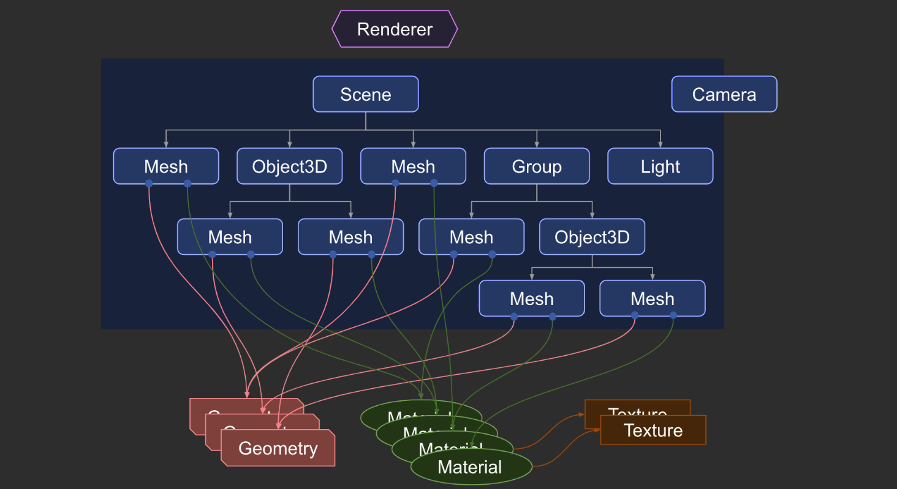

 

앞의 글에서 말했듯이 Three.js는 웹 페이지에서 3D객체를 쉽게 렌더링 할 수 있게 도와주는 라이브러리입니다. Three.js는 렌더링 하는 과정에서 `WebGL`을 사용하는데요. 물론 `WebGL`만 사용해서 3D 개발이 가능하지만 아주 많은 양의 데이터가 필요하고 복잡한 코드를 짜야하기 때문에  많은 개발자들이 Three.js를 사용하고 있습니다.

React Three Fiber에 대해 깊게 알아보기 전에 간단히 Three.js에 대해서 알아보고 정리해 보려고 합니다.

 

## Three.js에서 뭘 알아봐야 할까?

Three.js로 무언가를 표현하려면 이 다섯 가지의 요소에 집중해야 합니다.

#### Scene

Scene은 무언가를 표현하기 위해 만들어진 공간이라고 생각하면 쉽습니다. 이 공간 안에서 보여주고 싶은 화면을 객체, 모델, 입자, 조명 등을 사용해서 threejs에 렌더링 요청을 할 수 있습니다.

#### Mesh

Mesh는 쉽게 말해서 개발자가 3D 개발을 통해 보여주고 싶은 물체를 뜻합니다. 이 Mesh는 `Geometry`(기하학)을 받아 `Material`(재질)을 적용하면 만들어지는데 여기서 설정값을 통해 3D공간상의 위치와 자세를 결정할 수 있습니다.

- Geometry :
  기하학 객체의 정점 데이터입니다. 아주 다양한 것들이 표현될 수 있으며 [Three.js](https://threejs.org/docs/#api/ko/geometries/BoxGeometry "Three.js")에서 기본적으로 적지 않은 수의 내장 기하학 객체를 제공하고 있습니다.

- Material :
  기하학 객체를 그릴 때 사용되는 표면 속성입니다. 이것도 마찬가지로 [Three.js](https://threejs.org/docs/#api/ko/constants/Materials "Three.js")에서 기본적으로 제공하고 있는 재질들이 몇 가지가 있습니다.

#### Camera

현실에서도 카메라를 사용해 영화나 드라마의 한 장면을 찍듯이 3D공간에서도 [camera](https://threejs.org/docs/#api/ko/cameras/Camera "camera")를 사용해 하나의 `scene`을 촬영해 어떻게 보여줄 것인지를 결정할 수 있습니다. 카메라의 시점 및 위치를 통해 화면들을 보여주고 더 나아가 여러 대의 카메라를 사용해서 조금 더 다채로운 화면들을 만들어 낼 수 있습니다.

#### Renderer

Renderer은 렌더링을 해주는 중요한 요소입니다. Renderer에 카메라 시점을 사용해 `scene`을 렌더링 하도록 요청하면 그 결과가 `canvas`에 그려집니다.

#### Light

방안에 불을 켜야 사물들이 보이듯이 이 3D공간에서도 물체를 보기 위해 빛이 필요합니다. 제일 대표적인 것으로 `AmbientLight`(주변광)이나 `SpotLight`(집중광)이 있습니다.
