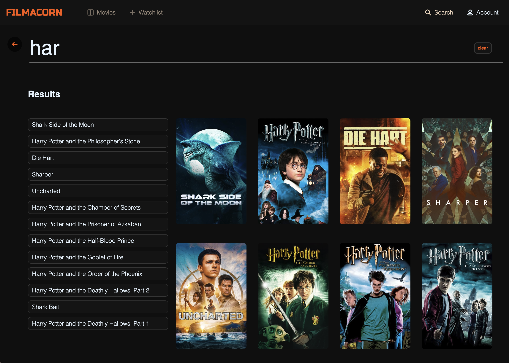
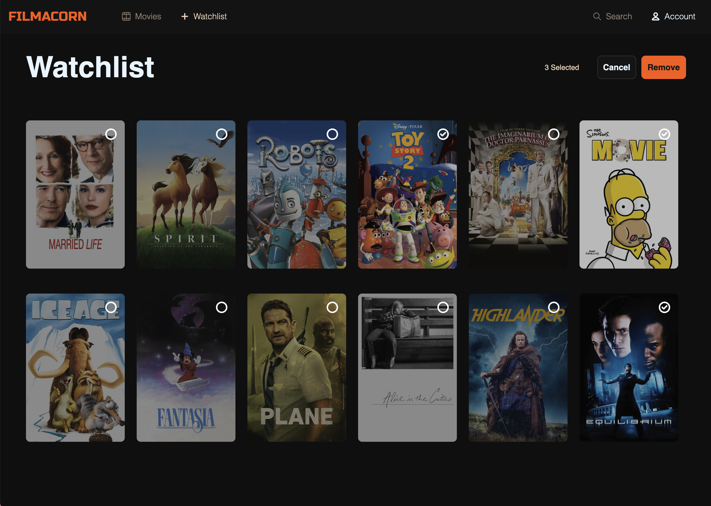
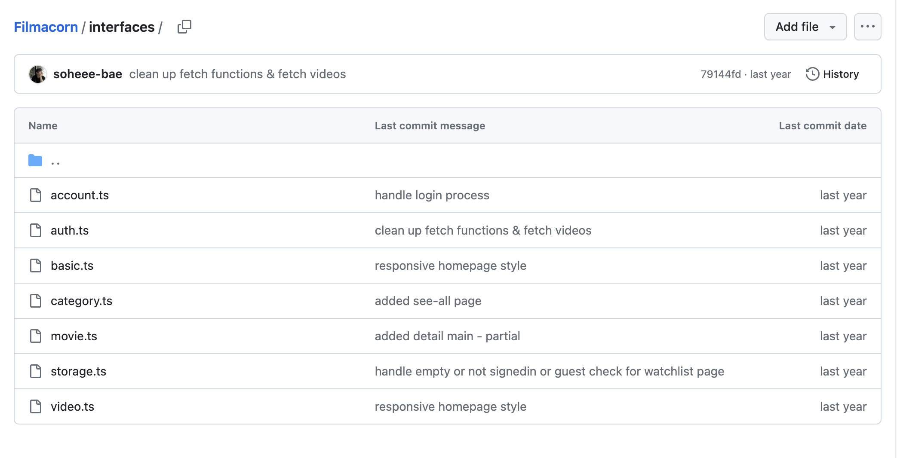
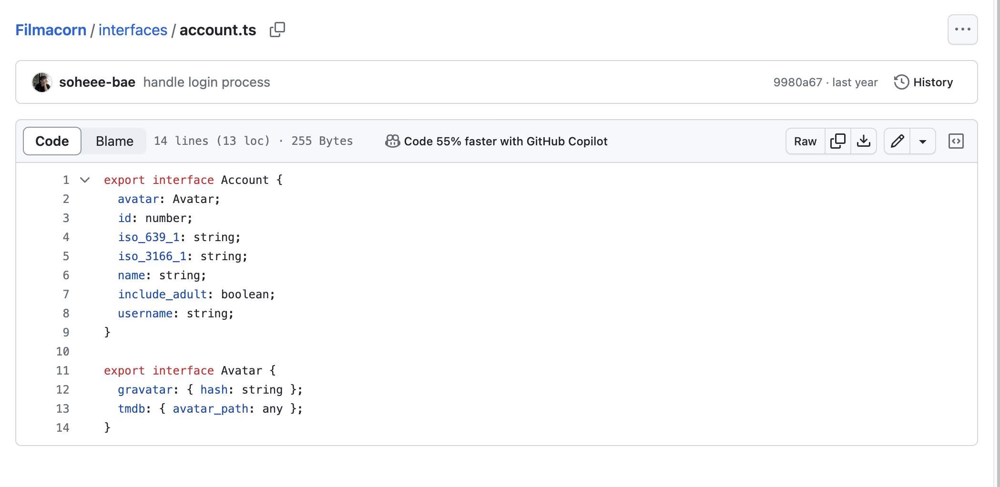
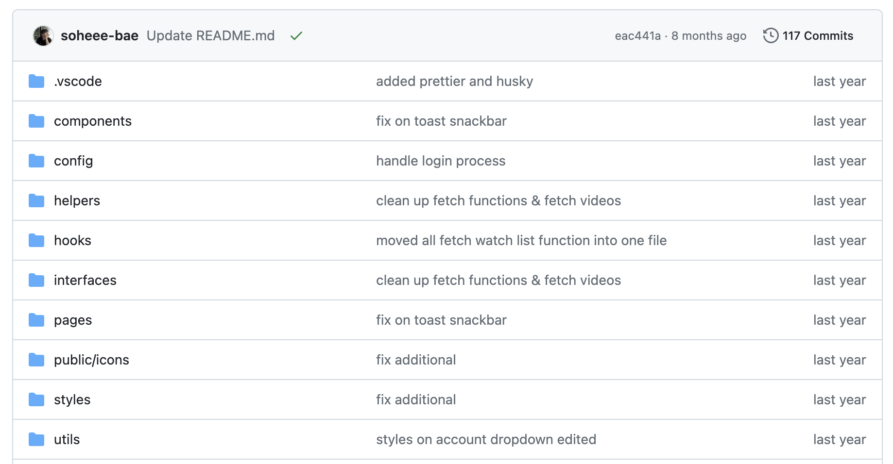
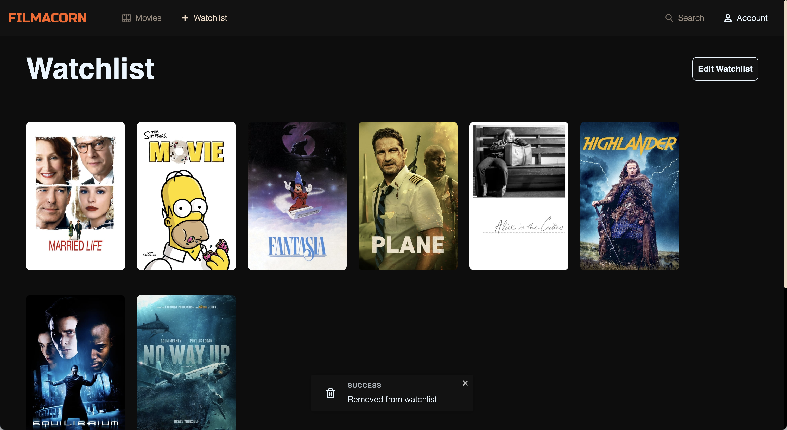

<br/>

<div style="width:100%; margin:auto; float:left; text-align:center;">

<div style="width:48%; margin:auto; float:left;">


##### 메인 페이지

</div>

<div style="width:48%; margin:auto; float:right;">


##### 영화리스트 페이지

</div>

</div>

<div style="width:100%; margin:auto; float:left; text-align:center;">

<div style="width:48%; margin:auto; float:left;">



##### 검색 페이지

</div>

<div style="width:48%; margin:auto; float:right;">



##### 찜한 영화 페이지

</div>

</div>

### 프로젝트를 진행하면서

<b>Nextjs 추가</b>

React 라이브러리의 프레임워크인 Next.js를 추가해서 프로젝트를 진행하였는데요 제일 큰 이유로는 SEO를 위한 Server-Side Rendering을 가능하게 하기 위해서 였습니다. 많은 양의 데이터들을 받아오고 보여줘야 했기에 pre-reloading을 통해 미리 데이터가 렌더링된 페이지를 가져오게 하고 싶었고 이로 인해 사용자에게 더 좋은 경험을 주고 싶었습니다.

매번 자동으로 업데이트 되는 TMDB 최신 데이터를 가져오기 위해서 getServersideProps를 주로 사용해서 데이터들을 가져와 사용했습니다.

<br/>

<b>TypeScript 추가</b>





이번 프로젝트에서는 TypeScript를 포함 시켜서 진행하였습니다. 많은 양의 데이터들을 받아서 사용하는 프로젝트 였기에 props에 대한 type들을 확실히 하여 보다 안정적인 개발과 코드 품질을 높이고 싶었습니다.

<br/>

<b>깔끔한 폴더 구조</b>



TypeScript 추가 및 많은 양의 페이지와 컴포넌트, hooks와 helper 함수들을 관리 하기 위해 깔끔한 폴더 구조에 신경을 썼습니다.

<br/>

<b>Carousel 기능 및 디테일한 애니매이션 추가</b>


기본적인 UI에 신경써서 개발하기보다는 사용자 경험을 향상 시키자는 목적이 있었기에 다양한 컴포넌트에 애니매이션을 넣었습니다. 주로 애니매이션은 css animation의 transition과 translate를 사용해서 hover 또는 dropdown 애니매이션 효과를 넣었고 carousel 효과를 위해서 오픈 라이브러리중 하나를 사용하게 되었습니다.

<br/>

<b>반응형 웹</b>

<div style="width:100%; margin:auto;">


</div>

단순히 웹 스크린 사이즈에서 사용하기 적합한 웹 사이트 보다는 모바일에서도 사용이 가능한 반응형 웹을 구현하였습니다.

<br/>

<b>재사용성 컴포넌트</b>

재사용성을 중요시 하기에 재사용 가능한 컴포넌트들을 미리 만들어 프로젝트 전체에 일관된 느낌의 UI를 주었고 코드의 품질을 높였습니다.

Size, Variant, startIcon, endIcon 등의 props들을 통해서 다양한 사이즈와 UI의 버튼을 사용할수 있게 만들었고 프로젝트 전체에서 쉽게 사용하였습니다.

```
// Button.tsx
    export type Size = "sm" | "md" | "lg" | "xl";
    export type Variant =
      | "contained"
      | "contained-outlined"
      | "outlined"
      | "text-outlined"
      | "text-color"
      | "text";

    interface ButtonProps {
      children: string | JSX.Element | ReactNode;
      variant?: Variant;
      size?: Size;
      startIcon?: JSX.Element;
      endIcon?: JSX.Element;
      onClick?: () => void;
      className?: string;
      disabled?: boolean;
      selected?: boolean;
    }
```

```
// HomeMain.tsx
  <Button size="lg" variant="contained" startIcon={<Play />} onClick={handleWatchNow} className={styles.homeButton}>
    Watch Now
  </Button>
```

<br/>

<b>Toast를 이용한 snackbar</b>



에러메세지나 알림 등을 보여줄 때 유용하게 쓰이는 토스트 메세지를 구현했습니다. React-toastify 라이브러리를 사용해 구현하였고 주로 사용자가 watchlist에 영화를 저장하거나 지울때 알려주기 위해서 사용하였습니다.

<br/>

<b>LoadingSpinner을 이용한 로딩 시간</b>

로딩이 길어지면 길어질수록 빈 화면이 오랫동안 보여지기에 사용성이 떨어지는데요 이를 방지하기 위해서 데이터를 불러오는데 생기는 텀에 자주 활용되는 로딩 UI로 Loading spinner을 추가하였습니다. api를 호출하면서 사용자를 위해서 "데이터를 가져오고 있어요"를 알려주기 위한 메세지 종류의 하나로 이 프로젝트에서는 직접 만든 로딩스피너 컴포넌트를 사용하였습니다.

<br/>

### 개인 프로젝트

프론트엔드 개발, 디자인, 기획

<br/>

### 활용한 기술스택

React, JavaScript, TypeScript, Next.js, SCSS, TMDB-api

<br/>

### 프로젝트 결과물

🔗 Github : https://github.com/soheee-bae/Filmacorn

🚀 Demo : https://filmacorn.vercel.app/

<br/>

### 구현한 기능

- 영화를 카테고리화해 추천해주고 보여주는 기능
- TMDB를 통한 회원가입 및 로그인
- 영화 찾아보기 기능
- 자세한 영화 정보 보기 및 비슷한 영화 추천 기능
- 유저들이 원하는 영화 리스트를 보관하고 저장할수 있는 기능

<br/>
