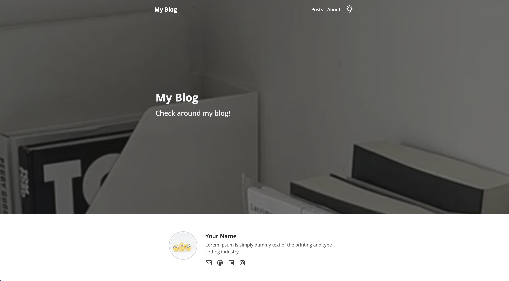
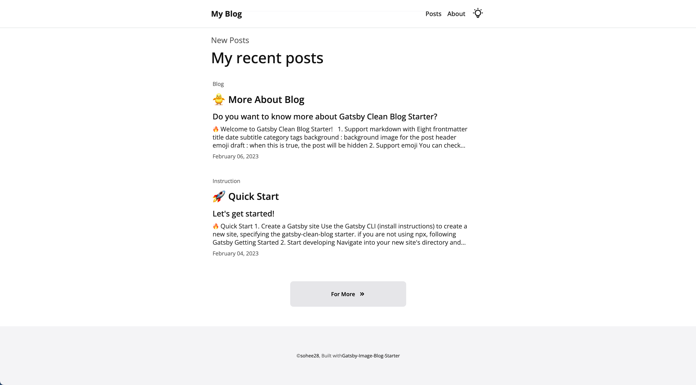
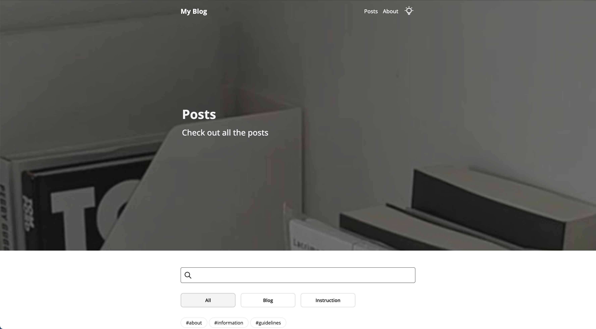
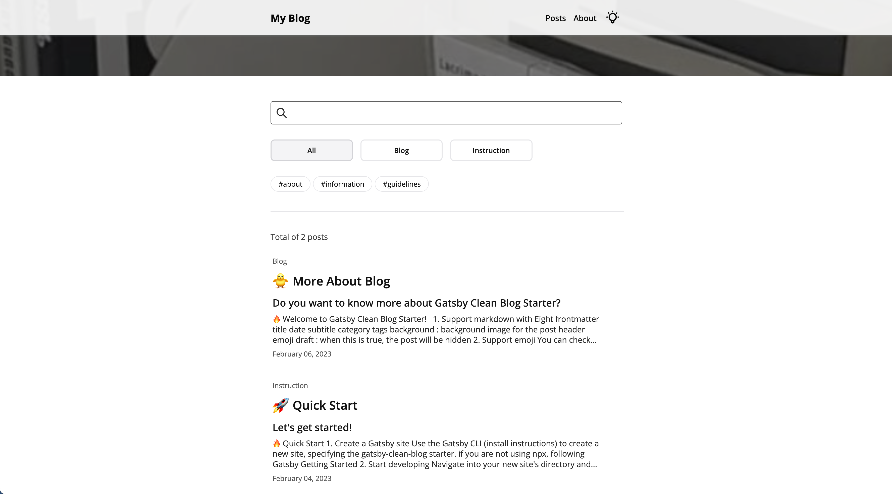
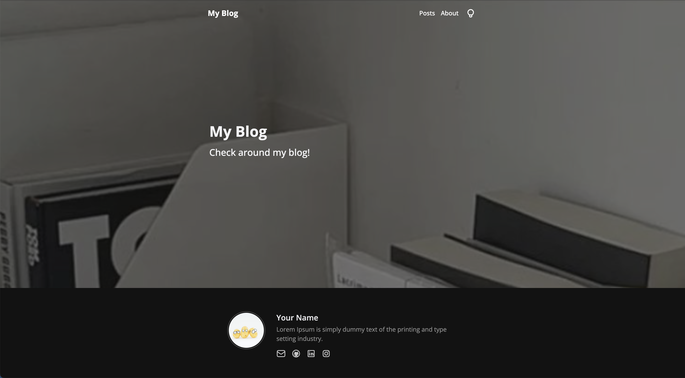
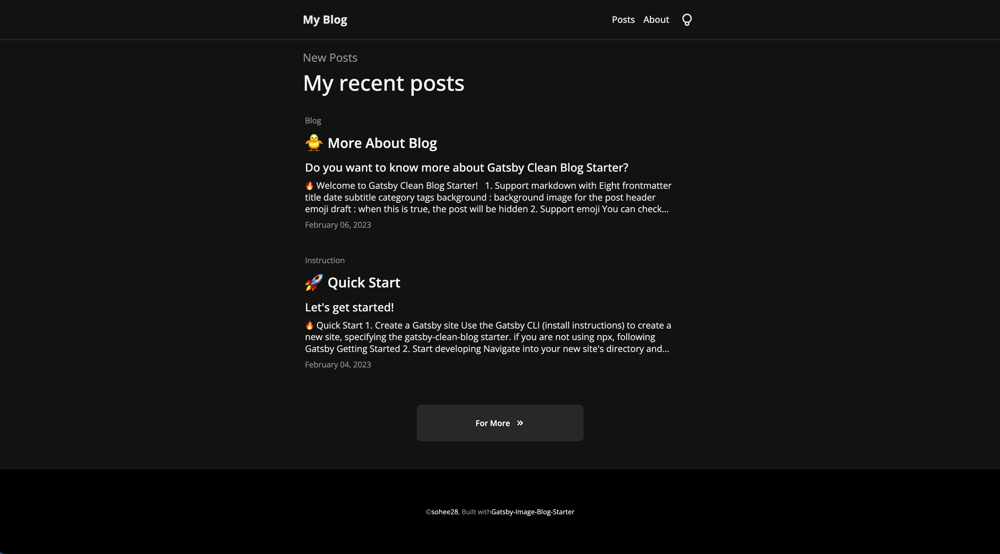
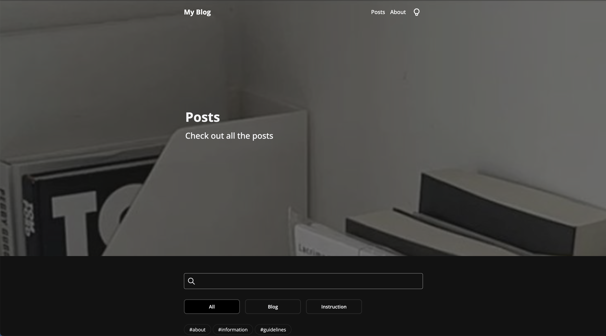
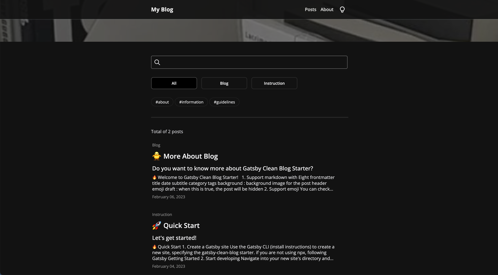
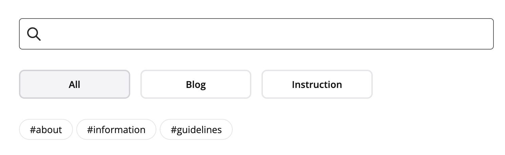

<br/>

## 프로젝트 결과물

🔗 Github : https://github.com/soheee-bae/Gatsby-Image-Blog-Starter

🚀 Demo : https://gatsby-image-blog-starter.netlify.app/

<br/>

<div style="position:relative; width:100%; margin:auto; text-align:center;">

<div style="float:left; width:48%; margin:auto; text-align:center;">



</div>

<div style="float:right; width:48%; margin:auto; text-align:center;">



</div>

<div style="float:left; width:48%; margin:auto; text-align:center;">



</div>

<div style="float:right; width:48%; margin:auto; text-align:center;">



</div>

</div>

<div style="float:left; width:100%; margin:auto; text-align:center;">

##### 라이트 모드

</div>

<div style="position:relative; width:100%; margin:auto; text-align:center;">

<div style="float:left; width:48%; margin:auto; text-align:center;">



</div>

<div style="float:right; width:48%; margin:auto; text-align:center;">



</div>

<div style="float:left; width:48%; margin:auto; text-align:center;">



</div>

<div style="float:right; width:48%; margin:auto; text-align:center;">



</div>

</div>

<div style="float:left; width:100%; margin:auto; text-align:center;">

##### 다크 모드

</div>

<div style="float:left; width:100%; margin:auto;">

<br/>

## 프로젝트를 끝내고

개인 프로젝트를 하면서 한번도 프로젝트에 대한 불편한 점들과 보안했으면 하는 기능들을 모아 Version 2로 업데이트를 해본 경험이 없었기에 이번 업데이트 과정이 조금 더 새롭고 흥미로웠던 것 같습니다. 업데이트 후의 디자인, 기능들이 전과 크게 비교되고 훨씬 더 깔끔하고 사용자들이 보다 더 편하게 쓸 수 있을것 같다는 생각에 업데이트 하길 잘 했다고 생각이 됩니다. 이번 업데이트는 사용자가 블로그 게시글 마다 각각의 개성을 담아 꾸밀 수 있게 만드는것에 중점을 두었고 저 또한 그 사용자중 한명이 될 것입니다.

</br>

### 💭 기억에 남는 구현

<div style="width:100%; margin:auto; text-align:center;">



</div>

이전 버전의 프로젝트에서 제일 많은 신경을 썼었던 기능은 목차 기능이였는데요. 이번 업데이트 과정중 단순히 목차 기능을 제거하는것 보단 조금 더 실용성있고 활용도가 높은 대체 기능을 구현하고 싶었습니다. 고민끝에 나온 결정은 게시글 <b>filtering과 search 기능</b> 추가였습니다. 사용자들이 조금 더 쉽게 찾고자하는 게시글을 찾거나 게시글들을 카테고리 또는 태그를 기준으로 필터링 할수 있는 기능을 구현하는게 좋겠다고 생각했습니다. 이전 버전의 목차와는 다르게 graphql을 사용해서 파일 구조를 파악해 자동으로 목차를 만들기 보단 사용자가 게시글을 작성할때 마다 frontmatter중 하나인 `category` 또는 `tags`에 직접 입력해 그 기준으로 filtering 할수 있게 만들었습니다.

</br>

### 💭 가장 고민했던 부분

```
// 업데이트 전
title: "More About Blog"
date: 2023-02-06 9:51:13
subtitle: "Do you want to know more about Gatsby Clean Blog Starter?"
category: "Blog"
draft: false

// 업데이트 후
title: "More About Blog"
date: 2023-02-06 9:51:13
subtitle: "Do you want to know more about Gatsby Clean Blog Starter?"
category: "Blog"
tags:
  - about
  - information
background: "stickyNote.jpeg"
emoji: "🐥"
draft: false
```

디자인에 중점을 두어 업데이트를 했던 만큼 새로운 디자인을 구현하는데 많은 시간을 썼습니다. 목차부분을 제거 하겠다는 결정과 동시에 블로그 전체 레이아웃에 큰 UI 변경을 주어야 했고 제가 원하던 각각의 개성있는 블로그 게시글 페이지를 만들기 위해선 `frontmatter`의 수가 이전 버전보다 더 많아야 했습니다. 여기서 제일 고민했었던 부분은 `frontmatter`의 수를 늘리는 동시에 주어진 `frontmatter`들을 모두 다 활용하여 어떻게 한 페이지에 깔끔한 UI로 다 보여지게 할 수 있을까 였는데요. 그 답을 찾기 위해서 많은 검색들을 하게 되었습니다.

<br/>

### 💭 어려웠던 점

이 업데이트를 진행하면서 어려웠던 점은 기능 구현하기 또는 디자인 보단 원래 기존에 있던 코드를 수정하면서 새로운 프로젝트를 만드는 게 생각보다 어려웠던 것 같습니다. 만약 아주 조금의 업데이트 또는 수정이 필요했더라면 이 어려움이 크게 와닿았진 않았겠지만 많은 UI 변경과 기능 추가로 인해 크고 작은 양의 코드들을 수정해야했기에 단순히 하나의 컴포넌트를 고치거나 업데이트 하기 보단 그 하나의 컴포넌트가 사용되고 있는 다른 파일 또는 연관되어 있는 파일들을 고려하여 코드를 작성해야 하는점이 생각보다 복잡하고 어려웠습니다. 지금 생각해보면 오히려 기존 코드를 수정하기 보단 처음부터 아무것도 없는 새로운 프로젝트를 하나 하는 느낌으로 했으면 어떨까하는 아쉬움이 남습니다.

</br>

### 💭 무엇을 배웠고 어떤 부분이 성장했나?

사이드 프로젝트 하나를 완성하기에 많은 시간이 필요하고 과정들을 거쳐야 한다는건 알고 있는 부분이였지만 업데이트 또한 그만큼의 시간과 노력이 필요하다는걸 이 V2를 통해서 알게 되었습니다. 업데이트 하는 과정에서 계속 스스로에게 물어봤었던 질문은 "내가 만약에 이 블로그 탬플릿의 사용자라면 어떤 부분이 불편하고 어떤 부분이 개선 되었으면 할까" 였습니다. 사용자의 시각으로 프로젝트를 보고 판단할수 있는 능력을 기르면서 개선했으면 하는 부분들을 정리해 직접 수정하는 법을 배웠습니다. 더 나아가서 수정하는 과정에서 기존의 코드를 더 깔끔하게 정리하는 능력을 성장시켰습니다.

</br>

### 💭 추가 하고 싶은 기능

#### utterances를 이용한 댓글 기능

다른 개발자나 사용자들이 블로그에 방문을 했을때 글을 읽고 댓글을 남길수 있다면 블로그가 소통의 창구가 되는 동시에 더 실용적일꺼라고 생각합니다.

#### 참고 창

글쓴이가 글을 작성했을때 사용했던 링크들을 한곳에 모아 놓을수 있는곳이 있다면 글쓴이 본인 뿐만 아니라 글을 읽는 사람들에게도 크게 도움이 될 것 같습니다.

</div>

<br/>
