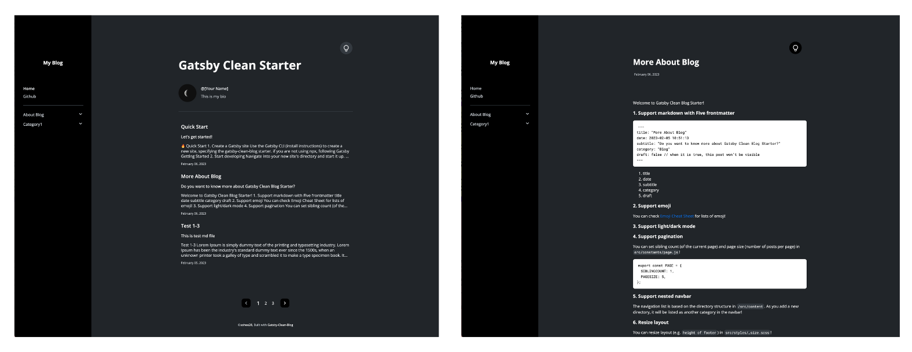

 

##### 라이트모드

##### 다크모드

### 프로젝트를 진행하면서

- 가독성을 높이고 사용자들이 쉽게 하드코딩된 문자열과 숫자들을 변경할수 있게 하기 위해서 `constrants` 폴더에 나열하고 정리하였습니다.
- 쉬운 스타일 커스터마이징을 위해 `styles` 폴더에 모든 스타일링을 정리하였습니다.
- 여러가지의 hook을 포함시키면서 props를 넘겨주는 방법을 최소화하고 페이지네이션과 목차 선택 값등을 여러 컴포넌트에서 쉽게 접근할수 있도록 하였습니다.
- Graphql plugin을 활용해서 이미지와 파일시스템등을 관리하였습니다.
- 아토믹 디자인 패턴을 활용하여 컴포넌트 단위 개발과 반응형으로 디자인하여 개발하였습니다.

 

### 개인 프로젝트

프론트엔드 개발, 디자인, 기획

 

### 활용한 기술스택

Gatsby, Graphql, React, SCSS

 

### 프로젝트 결과물

🔗 Github : https://github.com/soheee-bae/Gatsby-Clean-Blog-Starter

🚀 Demo : https://gatsby-clean-blog-starter.netlify.app/

 

### 구현한 기능

- Graphql을 활용한 폴더 구조 파악으로 자동화되는 목차
- 등록된 게시글 수와 현재 페이지 번호에 반영된 페이지네이션
- 라이트모드와 다크모드 기능
- 반응형 레이아웃
- 게시글을 자세히 볼수 있는 페이지
- 목차와 게시글을 한눈에 볼수있는 메인 페이지

 
