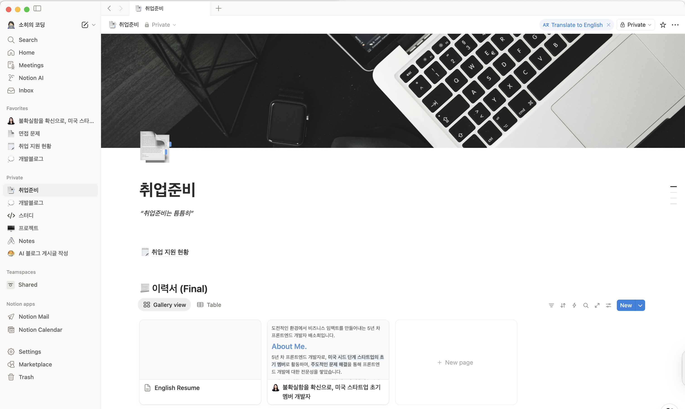

1월이 방향을 정한 달, 2월이 버티며 쌓아간 달이었다면 3월은 드디어 그 과정의 결과를 마주한 달이었다.

  

##### 나의 Notion

 

## 선택과 집중

3월에는 이전과 조금 다른 선택을 했다.

무작정 많은 회사에 지원하기보다, 내가 정말 가고 싶은 회사들, 그리고 더 도전해 보고 싶은 기업들에 집중했다. 지원의 개수를 늘리기보다 하나의 기회를 더 깊이 준비하는 방향을 택했다.

그 선택은 자연스럽게 준비 방식도 바꾸게 만들었다.

1차에서는 주로 라이브 코딩 테스트나 기본적인 면접이 중심이었다면, 2차, 3차 면접으로 갈수록 준비 방식이 완전히 달라졌다.

단순히 문제를 푸는 것을 넘어, 아키텍처를 어떻게 설계할지, 그 구조를 어떻게 설명하고 전달할지를 함께 고민하게 되었다. 화이트보드에 직접 흐름을 그려 가며 설명하는 상황을 대비해, 종이에 작성하면서 미리 구조를 정리하고 말로 풀어보는 연습도 반복했다.

  

##### 2차 면접을 대비해 정리했던 아키텍처 노트

이 과정에서 단순히 “아는 것”이 아니라 “설명할 수 있는 것”이 얼마나 중요한지 느끼게 되었다.

- 예상 질문을 정리하고
- 나의 경험을 구조적으로 정리하고
- 기술적인 부분뿐 아니라 “왜 그렇게 생각하는지”까지 고민했다

면접을 “통과해야 하는 과정”이 아니라 “나를 보여주는 자리”로 받아들이기 시작했다.

 

## 달라진 태도

3월의 면접에서 가장 크게 느낀 변화는 결과보다도, 면접을 대하는 나의 태도였다.

- 더 이상 지나치게 떨지 않았고
- 질문에 당당하게 답하려고 했고
- 모르는 것은 솔직하게 인정하면서도 내가 아는 선에서 끝까지 생각을 이어갔다

특히, 내 의견을 말할 수 있게 되었다는 점이 가장 컸다.

이전에는 "정답을 맞춰야 한다"는 생각이 강했다면 이제는 <em>"나는 이렇게 생각합니다"</em>라고 말할 수 있게 되었다.

특히 한 면접에서 "면접을 얼마나 보셨어요?" 라는 질문을 받은 뒤, "연습을 많이 하고 준비를 많이 하신 것 같아서요" 라는 말을 들었을 때 그걸 더 실감할 수 있었다.

 

## 결과로 이어진 과정

그 변화는 자연스럽게 결과로 이어졌다. 여러 회사의 다음 전형으로 이어졌고, 2차 면접까지 진행하게 된 곳들도 많았다.

  

##### 나의 Notion

그리고 그 과정의 끝에서 <strong>CJ올리브영 최종 합격</strong>이라는 결과를 받게 되었다.

이직 준비를 시작할 때만 해도 이런 결과를 상상하기 어려웠는데, 3월에는 “면접의 끝”이자 “취업의 끝”을 직접 마주하게 되었다.

 

## 끝이 아니라, 시작

  

##### 나의 Notion

하지만 이상하게도 합격 이후 가장 많이 들었던 생각은 <em>"이제 시작이다"</em>였다.

취업은 목표였지만, 결국 내가 원하는 건 더 잘하는 개발자가 되는 것이기 때문이다.

그래서 여기서 멈추지 않으려고 한다.

- 계속해서 기본기를 다지고
- 더 깊이 이해하려고 하고
- 실무에서 부딪히며 배우고

지금까지 해왔던 것처럼 천천히, 하지만 꾸준하게 성장해 나가고 싶다.

 

## 3개월을 돌아보며

1월에는 방향을 잡았고,

2월에는 흔들리면서도 버텼고,

3월에는 그 결과를 마주했다.

이 세 달 동안 가장 크게 달라진 건 실력보다 더 크게 달라진 건 태도였다.

- 도망치지 않게 되었고
- 부족함을 인정하게 되었고
- 그래도 계속 해보려는 사람이 되었다

이 변화가 앞으로를 더 기대하게 만든다.

 

## 마무리

3월은 끝이 아니라 전환점이었다.

이직 준비의 끝이 아니라, 개발자로서의 다음 단계의 시작.

앞으로 더 어려운 순간들도 많겠지만 지금까지 해 왔던 것처럼 포기하지 않고 계속 쌓아 가고 싶다.
