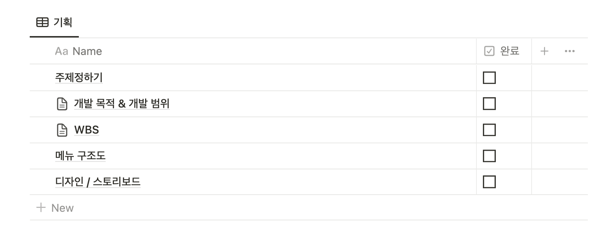
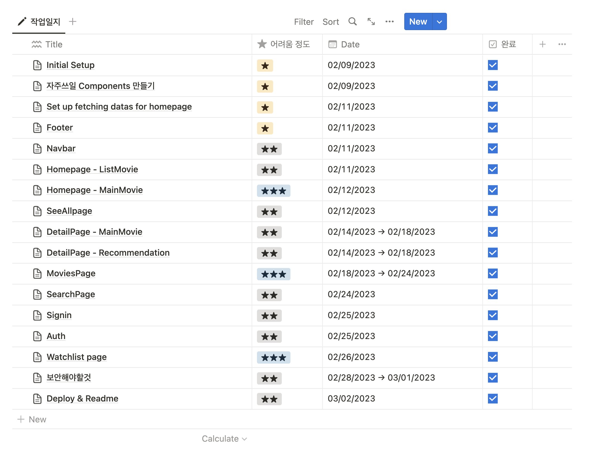

 

## 웹 개발자가 94%의 J형일때

저는 MBTI 검사를 하면 J가 94% 나오는 개발자입니다. MBTI 검사가 증명했듯이 완벽한 계획형으로 일상에서 무언가를 실행하고 행동으로 옮기기전에 항상 계획을 하고 그에 따라가는것을 선호 합니다. 이 J형 성격이 제일 잘 들어날때에는 제가 일할때나 개인 프로젝트 할때에 뚜렷히 나타나는데요. 이 글을 통해 개발자가 J형일때 어떤식으로 계획을 하고 구성을 할까라고 궁금해하는 분들을 위해서 또는 개인 프로젝트를 시작할때 어려움을 겪고 계신 개발자분들을 위해서 몇자 적어볼까 합니다.

 

> <b>“시작이 반이다”</b>

 

저는 개인 프로젝트를 할때 개발하는 과정 못지 않게 그 전 단계인 계획하는 단계도 정말 중요하다고 생각하는 사람입니다. 그래서인지 자주 계획하는 단계에서 좀 더 많은 생각을 하고 노트 정리를 하곤 합니다. 제가 주로 사용하는 어플은 노션이라는 기록어플이고 이 어플을 통해 몇단계로 나누어 개인 프로젝트를 계획합니다.

1. 기획
2. 설계 및 구현
3. 작업과정
4. 마무리 작업

 

## 기획

1. 이 프로젝트가 무엇을 목표로 하고 있는가?
2. 이 프로젝트의 핵심기능은 어떤것들이 있는가?

개인 프로젝트에서 제일 근본적이고 기본적인 **“무엇을 만들까?”** 라는 생각을 정리하는 구간입니다. 프로젝트 주제를 정하고 개발 목적과 개발 범위를 간단히 생각하여 정리하면서 프로젝트의 방향성을 잡을수가 있습니다. 더불어 필요한 기능들이나 비슷한 프로젝트들의 예들을 많이 온라인으로 찾아보며 프로젝트의 큰 틀을 만들어줍니다.

글로 정리하는것 외에 저는 메뉴 구조도와 디자인에도 시간을 들여서 정리를 합니다. 대부분 메뉴 구조도는 whimsical.com을 이용해서 만들고 있고 디자인은 Figma를 이용해서 만들고 있습니다. 가끔 Figma로 완벽한 디자인을 하기엔 부담스러울때가 있는데요. 저는 그럴땐 우선 아주 간단히 종이에 아주 큰 레이아웃만 구성하고 기능구현을 다 끝낸다음에 다시 돌아와서 디테일한 디자인을 하곤 합니다.

 

## 설계 및 구현

//사진

이젠 무엇을 만들지 정했으니 **“어떻게 만들까”**에 중점을 둡니다. 주제를 정하는 과정에서 프로젝트 아이디어를 얻기위해 여기저기 많은 비슷한 웹사이트들을 찾아보고 알아봤기 때문에 이 단계에서는 어떤 프레임워크가 많이 쓰였고 더 나아가서 필요한 라이브러리나 BE, DB를 충분히 알고 있는 상태일겁니다. 이 단계에서는 본인이 배우고 싶거나 자신있는 개발환경들을 정리해주고 필요한 라이브러리들을 알아보는 일들을 합니다.

- https://www.waldo.com/blog/react-native-project-structure

개발자마다 선호하는 파일 구조들이 있는데요. 저는 주로 Type-Based Project Structure을 쓰는걸 선호합니다.

 

## 작업과정

제가 제일 중요하게 생각하지만 제일 귀찮을 수 있는 단계인 작업일지 작성 단계입니다. 굳이 이 과정을 꼭 해야할 필요는 없지만 저는 하는것을 추천 하고 싶습니다. 개발을 할때마다 기록을 남기고 작성해야 한다는건 쉬운 일이 아닙니다. 하지만 나중을 위해선 제일 중요한 과정이라고 여기는 작업과정 단계인데요. 저는 이런 기록들을 합니다.

- 오늘의 목표
- 어떤 걸 어떻게 만들었는지
- 무엇을 새롭게 배웠는지
- 개발 과정중 어떤 에러가 있었고 어떻게 해결했는지
- 만들고 난 후의 간단한 소감

 

## 마무리 작업

저는 앞 작업과정중에 그때그때마다 생각나는 보안할것들을 이 구간에 정리 해 놓습니다. 이렇게 하지 않았을때 항상 뭔가 하나씩 빠뜨리고 나중에가서 하기엔 귀찮아서 안 하게 되더라고요. 간단히 정리 해 뒀던 보안 리스트를 하나하나씩 해 나가면서 프로젝트를 마무리 합니다.

정말 당연하고 별거 없는 개발 계획 순서 및 과정이지만 조금이나마 도움이 되었으면 좋겠습니다. 저희가 개발하는 과정중에서 무언가를 배우게 되는건 당연합니다. 하지만 이 과정들을 기록하고 세분화해 계획함으로써 어떤걸 어떻게 배웠는지 좀더 정확하게 알수 있게 됐고 나중에 까먹었을때 다시 돌아와 보며 기억할수 있는 좋은 정보이자 기록이 될것입니다.
