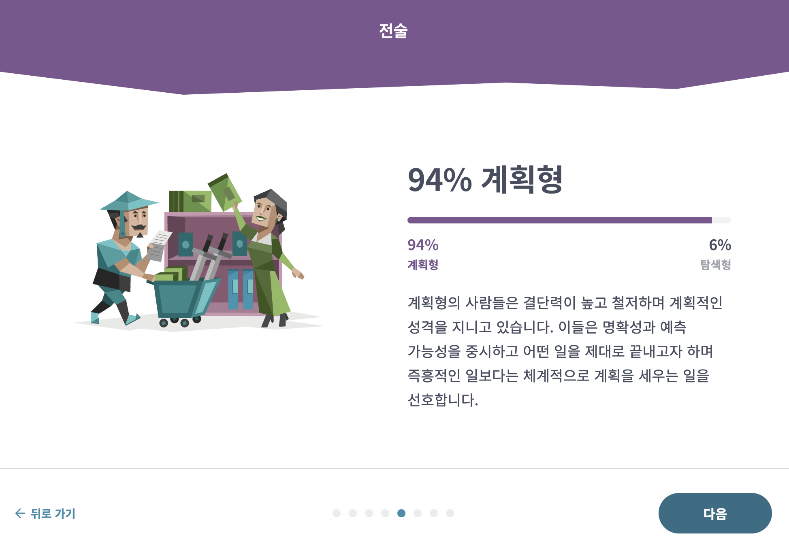
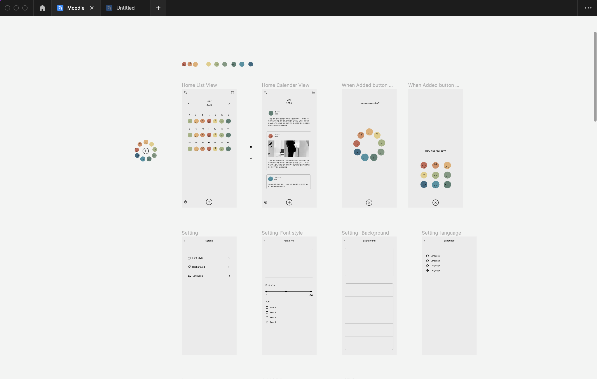
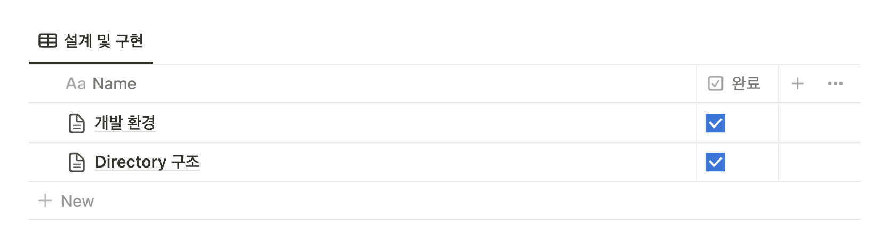
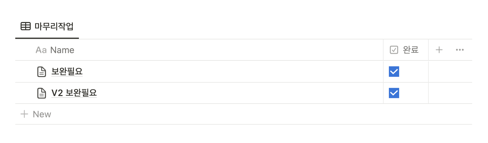

 

## 웹 개발자가 94%의 J형일때

 

 

저는 MBTI 검사를 하면 J가 94% 나오는 개발자입니다. MBTI 검사가 증명했듯이 완벽한 계획형으로 일상에서 무언가를 실행하고 행동으로 옮기기 전에 항상 계획을 하고 그에 따라가는 것을 선호합니다. 이 J형 성격이 제일 잘 드러날 때에는 제가 일할 때나 개인 프로젝트 할 때에 뚜렷이 나타나는데요. 이 글을 통해 개발자가 J형일 때 어떤 식으로 계획을 하고 구성을 할까라고 궁금해하는 분들을 위해서 또는 개인 프로젝트를 시작할 때 어려움을 겪고 계신 개발자분들을 위해서 몇 자 적어볼까 합니다.

 

<b>“시작이 반이다”</b>

 

저는 개인 프로젝트를 할 때 개발하는 과정 못지않게 그전 단계인 계획하는 단계도 정말 중요하다고 생각하는 사람입니다. 그래서인지 자주 계획하는 단계에서 좀 더 많은 생각을 하고 노트 정리를 하곤 합니다. 제가 주로 사용하는 어플은 노션이라는 기록어플이고 이 어플을 통해 몇 단계로 나누어 개인 프로젝트를 계획합니다.

1. 기획
2. 설계 및 구현
3. 작업과정
4. 마무리 작업

 

## 기획

- 이 프로젝트가 무엇을 목표로 하고 있는가?
- 이 프로젝트의 핵심기능은 어떤 것들이 있는가?

개인 프로젝트에서 제일 근본적이고 기본적인 **“무엇을 만들까?”**라는 생각을 정리하는 구간입니다. 프로젝트 주제를 정하고 개발 목적과 개발 범위를 간단히 생각하여 정리하면서 프로젝트의 방향성을 잡을 수가 있습니다. 더불어 필요한 기능들이나 비슷한 프로젝트들의 예들을 많이 온라인으로 찾아보며 프로젝트의 큰 틀을 만들어줍니다.

글로 정리하는 것 외에 저는 메뉴 구조도와 디자인에도 시간을 들여서 정리를 합니다. 대부분 메뉴 구조도는 [Whimsical](https://whimsical.com/ "Whimsical")을 이용해서 만들고 있고 디자인은 [Figma](https://figma.com/ "Figma")를 이용해서 만들고 있습니다. 가끔 Figma로 완벽한 디자인을 하기엔 부담스러울 때가 있는데요. 저는 그럴 땐 우선 아주 간단히 종이에 아주 큰 레이아웃만 구성하고 기능구현을 다 끝낸다음에 다시 돌아와서 디테일한 디자인을 하곤 합니다.

###### _Figma 디자인_

 

###### _메뉴구조도_

 

## 설계 및 구현

이젠 무엇을 만들지 정했으니 <b>“어떻게 만들까”</b>에 중점을 둡니다. 주제를 정하는 과정에서 프로젝트 아이디어를 얻기 위해 여기저기 많은 비슷한 웹사이트나 프로젝트를 찾아보고 알아봤기 때문에 이 단계에 도착했을 땐 어떤 프레임워크가 주로 많이 쓰였고 더 나아가서 필요한 라이브러리들이나 BE, DB에 대한 정보가 어느 정도는 있는 상태일 겁니다. 이 단계에서는 본인이 배우고 싶거나 자신 있는 개발환경들을 기준으로 프로젝트에 쓰일 개발환경 리스트를 정리해 주고 필요한 라이브러리들을 알아보는 일을 합니다.

여기서 저는 미리 [파일 구조](https://www.waldo.com/blog/react-native-project-structure "파일 구조")를 정하고 시작하는 것을 좋아합니다. 개발자마다 선호하는 파일 구조들이 있는데요. 저는 주로 Type-Based Project Structure을 쓰는 걸 선호합니다.

 

## 작업과정

사실상 제가 제일 중요하게 생각하지만 제일 귀찮을 수 있는 단계인 작업일지 작성 단계입니다. 굳이 이 과정을 꼭 해야 할 필요는 없지만 저는 하는 것을 꼭 추천하고 싶습니다. 개발을 할 때마다 기록을 남기고 작성해야 한다는 건 절대 쉬운 일이 아닙니다. 물론 그만큼 시간도 두배로 들기도 합니다. 하지만 배움에서 유일하게 시각적으로 남길 수 있는 것은 기록이라고 생각이 드는 만큼 많은 개발자들이 배운 것들을 글로 남깁니다. 좀 더 자세하게는 이런 기록들을 합니다.

- 오늘의 목표
- 어떤 걸 어떻게 만들었는지
- 무엇을 새롭게 배웠는지
- 개발 과정 중 어떤 에러가 있었고 어떻게 해결했는지
- 만들고 난 후의 짧은 소감이나 느낌

 

## 마무리 작업

저는 앞 작업과정 중에 그때그때마다 생각나는 보안할 것들을 이 구간에 정리해 놓습니다. 이렇게 하지 않았을 때 항상 뭔가 하나씩 빠뜨리고 나중에 가서 하기엔 귀찮아서 안 하게 되더라고요. 간단히 정리해 뒀던 보안 리스트를 하나하나씩 해 나가면서 프로젝트를 마무리해줍니다.

정말 당연하고 별거 없는 개발 계획 순서 및 과정이지만 조금이나마 도움이 되었으면 좋겠습니다. 저희가 개발하는 과정 중에서 무언가를 배우게 되는 건 당연합니다. 하지만 이 과정들을 기록하고 세분화해 계획함으로써 어떤 걸 어떻게 배웠는지 좀 더 정확하게 알 수 있게 되고 나중에 시간이 지났을 때 다시 돌아와 보면 다시 참고할 수 있는 좋은 정보이자 기록이 될 것입니다.
