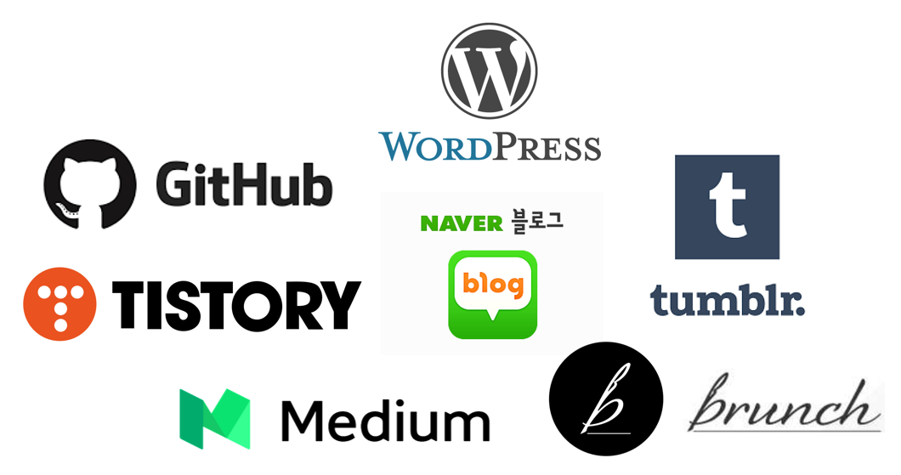
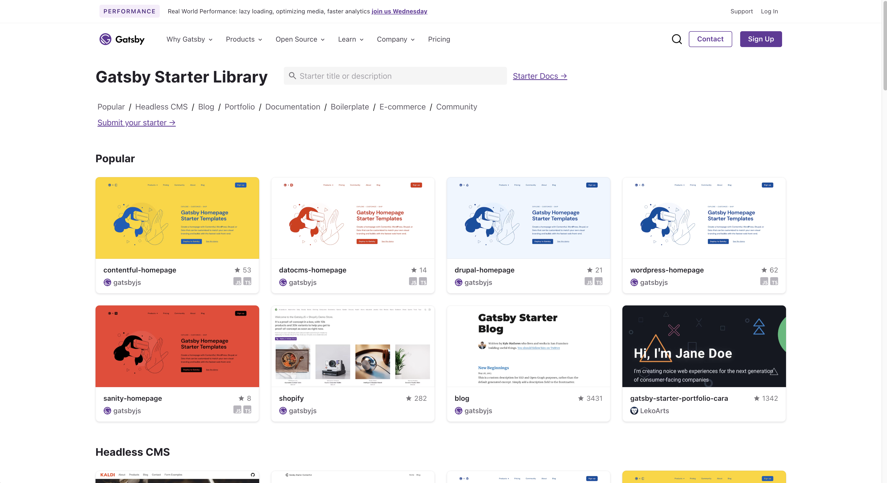
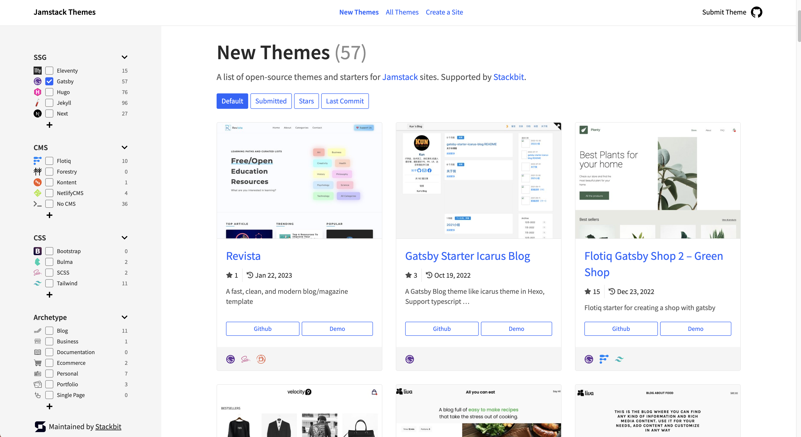

 

## 플랫폼 고민

 
블로그를 시작하기에 앞서 제일 먼저 생각했던 건 <b>“어떤 플랫폼을 써야 할까??”</b> 였습니다.

 
 

 

며칠 동안 여기저기 찾아보고 들었던 생각은 개발자 블로그를 시작할 때 많은 개발자들이 고려해야 할 점이 명확하게 크게 두 가지로 나뉘는 것 같았는데요.

- 간단하고 쉽지만 꾸미는 데 한계가 있는 플랫폼

- 복잡하고 어렵지만 자유롭게 꾸밀 수 있는 플랫폼

 
많은 고민 끝에 전 자유롭게 꾸밀 수 있는 플랫폼을 선택했고 그 이유는 다음과 같습니다.

**1. 코드를 읽고 쓸 수 있는 사람의 혜택**

개발자라는 직업을 뒷 배경으로 코드를 쓰고 읽을 수 있는 저에겐 플랫폼을 자유롭게 꾸미고 운영할 수 있다는 것은 모든 사람들에겐 주어지진 않는 큰 혜택이라고 생각했습니다. 물론 그만큼 더 많은 시간을 쏟아부어야 하겠지만 할 수 있는 범위가 더 넓어진다면 그것만큼 중요한 게 없다고 생각했습니다.

**2. 꾸준함에 동기부여**

개발도 직접 꾸미기도 직접 함으로써 블로그에 대한 애착도 증가가 꾸준함으로 이어질 것이라는 믿음이 있습니다. 아무래도 처음부터 끝까지 모든 게 제 손을 거쳐가야 하기 때문에 더 많은 시간을 쏟을 것이고 그만큼 블로그를 꾸준하게 운영할 수 있는 동기부여가 될 거라고 믿었습니다.

**3. Github과 호환 가능**

개발자라면 누구나 알고 꼭 가지고 있는 Github과 호환된다는 점은 큰 장점이 됩니다. 매일 하루에 한 번은 꼭 열어보고 사용하는 Github에 호환이 됨으로써 블로그뿐만이 아닌 제 Github 자체를 더 자주 사용하게 될 것이고 이것이 좋은 습관이 된다면 1일 1 커밋은 저에겐 좋은 기록이 될 거라고 생각했습니다.

프론트엔드 개발자라서 그런지 웹 디자인이나 보이는 화면이 이쁘면 개발하고자 하는 의지가 커지고 개발 생산성이 더 향상된다고 생각합니다. 그만큼 시각적으로 보이는 게 웹 쪽에서는 정말 중요하다고 생각하고 블로그도 마찬가지 일 것 같더군요. 깃헙 블로그의 최대 장점은 투명함인 거 같은데요. 여기서 제가 말하는 투명함은 제가 시간을 투자하는 만큼 블로그가 성장하는 게 그대로 보일 것이고 바뀌어 나갈 것을 뜻합니다.

 

## 플랫폼을 정했으니 이젠 테마 고민!

 
이쯤 되니 블로그를 시작한다는 건 고민과 선택의 연속인 거 같다는 생각을 했습니다.

 

어떤 플랫폼을 사용할지 결정했으니 이젠 어떤 테마를 사용해 볼까였는데 github 페이지를 사용해서 블로그를 운영하고 있는 개발자들이 gatsby가 제일 좋다고 하더군요. 이 쪽 분야에  처음 발을 들인 만큼 남들이 안 하는 것을 하는 것보단 많이 사용되고 있고 무엇보다 인터넷에 자료가 많은 걸 하는 게 나을 것 같더라고요.

 

_[Gatsby Starter Library](https://www.gatsbyjs.com/starters/ "Gatsby Starter Library")_

 

_[Jamstack Themes](https://jamstackthemes.dev/ "Jamstack Themes")_

 

많은 사람들이 사용하고 있는 만큼 제 예상은 틀리지 않았습니다. 저 같은 gatsby 어린이를 위한 gatsby starter kit이 온라인 여기저기에 올라와 있더군요. 저도 스타터를 쓸까 해서 원하는 디자인을 여기저기 찾아봤지만 역시나… 제가 여간 까다로운 게 아니라서 아쉽게도 제 맘에 쏙 드는 걸 찾기가 힘들었습니다.

고민 끝에 직접 만드는 게 나을 것 같다는 결정을 했고 그 과정들을 기록해서 블로그에도 천천히 올릴 계획입니다. 아무래도 gatsby를 사용하는 건 처음이기 때문에 여기저기 찾아보면서 개발해야 하고 디자인도 직접해야 하기 때문에 시간이 많이 들진 않을까.. 어렵진 않을까… 걱정도 되지만 기대가 더 되는 건 사실입니다.

비록 이제 시작이지만 이 블로그를 통해서 많은 걸 배우고 기록해 나갈 수 있었으면 좋겠습니다.
