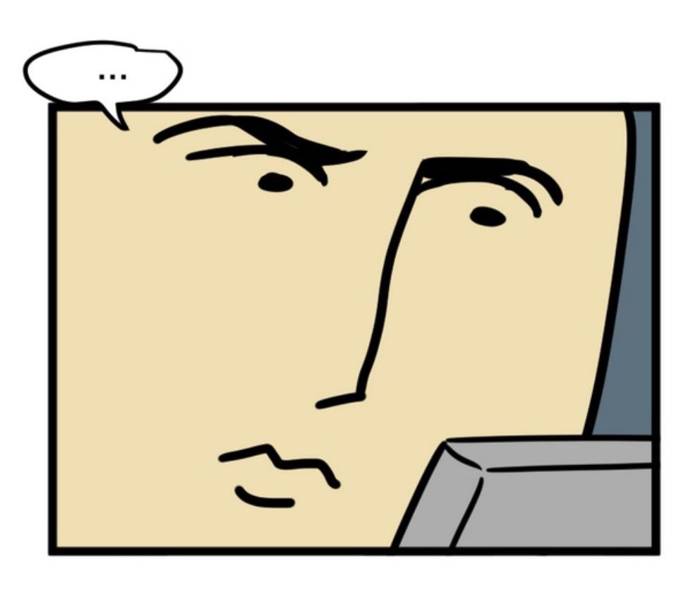
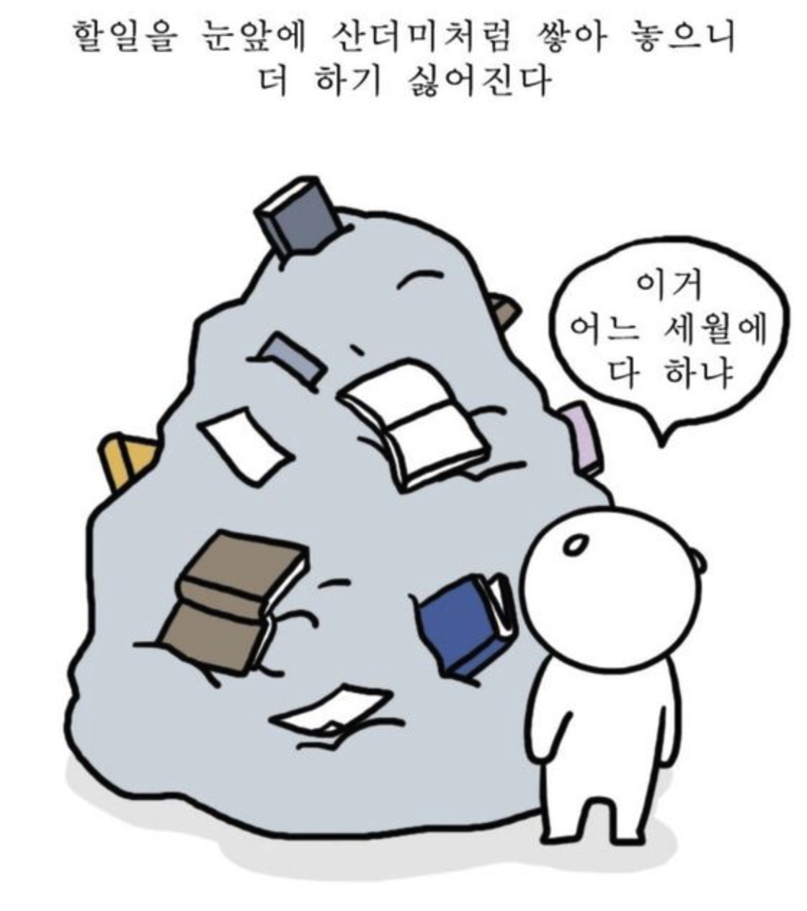

 

## 블로그의 ㅂ자도 모르던 나는?

 
2021년 5월에 첫 직장에 취업을 한 이후 전 그때부터 지금까지 일을 하면서 많은 것을 배워왔는데요. 매번 새롭게 배우는 것들이 있으면 노션을 이용해서 모든 걸 정리해왔었고 내용들이 많아지는 만큼 제 스스로가 성장하는 걸 느낄 수 있었습니다.

새롭게 배우는 것이 있을 때마다 기록으로 남겼고 점점 늘어나는 파일 페이지 수에 뿌듯함을 느꼈습니다. 하지만 진주 없는 조개껍데기를 모은다는 느낌은 이런 걸까요. 저 혼자만 그 내용들을 본다는 이유에서 부담감이 적어진 것인지 시간이 지나면 지날수록 노트 내용들이 의미가 없을 만큼 간략하게 정리가 되어 있다는 걸 확인할 수 있었습니다.

 

질보단 양에 관점을 두었던 저였습니다. 기록과 노트정리를 하는 제일 큰 이유는 제가 필요할 때 다시 꺼내 확인을 해보기 위한 것이었는데 그거 하나도 충족하지 못하고 있더군요.

웹 개발자라는 직업을 평생직업으로 생각하고 있는 저에겐 기록과 정리는 저에겐 꼭 필요한 습관이라는 생각을 하게 되었습니다.

 

## 갑자기 왜?

 
여기저기 찾아보며 해결방법을 생각해 보다가 문뜩 떠오른 게 "블로그!" 였는데요. 벌써 많은 개발자들이 각양각색의 다양한 동기를 가지고 본인들의 공부 기록들이나 자기 계발 과정들을 정리하며 사용하고 있더라고요.

제가 블로그에 대해서 생각해 봤던 적은 여러 번 있었지만 이상하리만큼 한 번도 실행에 옮겨진 적은 없습니다. 핑계 같지만, 개인 블로그를 운영한다고 하면 뭔가 많은 세팅과 준비과정에 많은 시간을 투자해야 한다는 생각이 들더군요.

 

 

특히 개인 기술 블로그인 특성상, 다른 사람들에게 내가 배운 지식을 잘 정리해서 알아듣기 쉽게 전달한다는 건 절대 쉬운 일이 아니라는 걸 알고 있기도 했고 유학생인 전 모든 개발 영역에선 영어로 배웠왔기 때문에 제 지식을 한국어로 풀어서 작성한다는 건 더더욱 큰 부담으로 다가왔습니다. 다른 사람들이 완벽하지도 않은 제 글을 읽고 본다는 생각에 따라오는 부담감과 두려움도 큰 역할을 한 것 같습니다.

하지만 변화가 있어야 성장도 있다고 하잖아요. 무섭다고 두렵다고 변화를 회피하고 미루는 시기는 지났다는 걸 인지함과 동시에 다른 개발자분들의 멋진 블로그들을 보고 동기부여를 받게 되었고 최근에는 개발자 채용 공고에서 개인블로그가 있을 경우 좀 더 우대해 준다는 경우도 봤었는데 그거 또한 저에겐 큰 의미를 주기도 했습니다.

 

## 저의 자그마한 목표

 
제가 블로그를 하면서 얻고자 하는 목표는 크게 세 가지로 나눌 수 있습니다.

 

**1. 스스로를 위한 개발 기록 습관 기르자**

너무나도 당연한 이야기지만 어느 정도의 정리가 된 글들을 기록하고 필요할 때 꺼내서 볼 수 있는 기록들을 남기고 싶었습니다. 결과적으로 이 기록들이 그냥 여러 개의 글로 남을 수도 있겠지만 기록하는 과정에서 저는 오랫동안 이어 나갈 수 있는 좋은 기록 습관을 얻고 싶습니다.

**2. 배운 지식을 온전한 내 것으로 만들자**

바쁜 현대 사회에서 살아남기 위해선 시간을 잘 활용해야 한다고 생각합니다. 주어진 시간 동안 배운 지식을 정확히 할 수 있는 것이 중요하고 정리하면서 잘못된 나의 지식을 바로 잡고 알던 내용이라면 더 자세히 알아보고 싶습니다.

**3. 1인분 하는 개발자가 되자**

직업이 아무리 개발자라고 해도 그만큼의 역할을 못하면 개발자라고 불리는 건 부끄러운 일인 것 같습니다. 제 성장과정을 블로그에 남기면서 욕심 없이 1인분 하는 개발자가 되는 게 제 마지막 목표입니다.

 

비록 한참 부족한 글 솜씨와 완벽하지 않은 지식이지만 몇 년 후에 이 블로그를 보며 나의 성장을 흐뭇하게 바라 볼 저를 기대하며 꾸준히 해 나가고 싶습니다.
