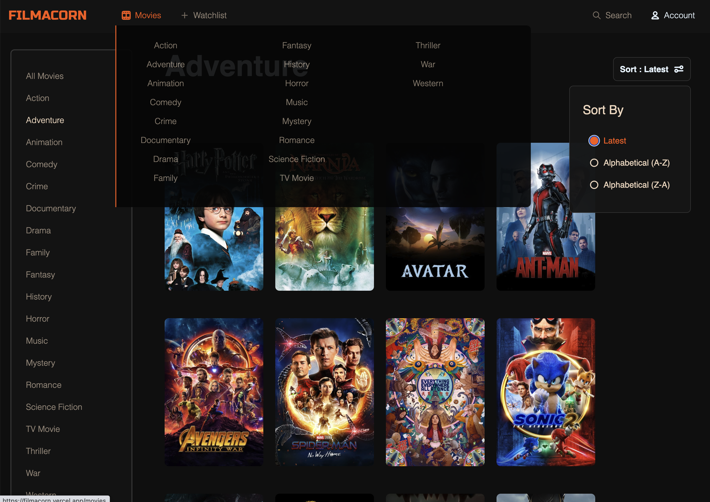
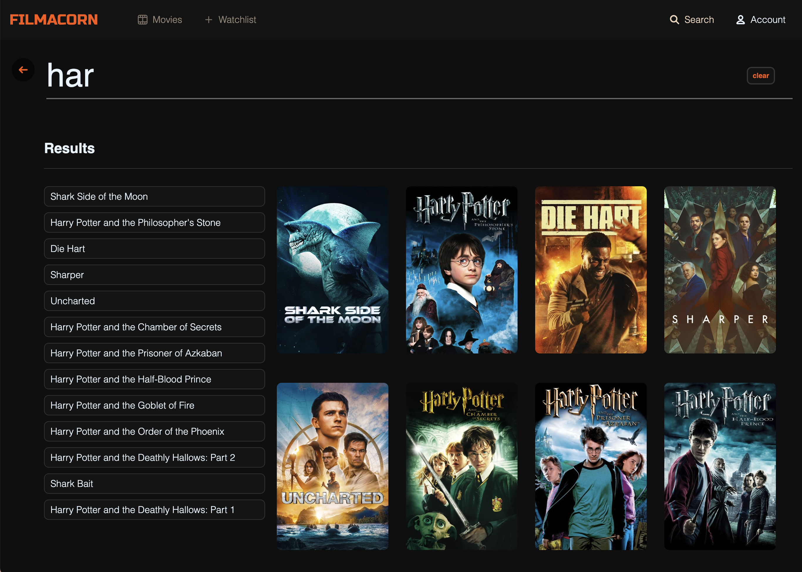
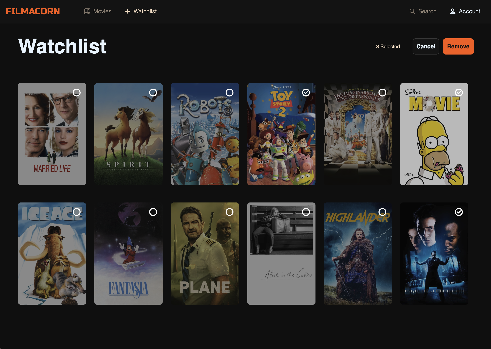

 

##### 메인 페이지

##### 영화리스트 페이지

##### 검색 페이지

##### 찜한 영화 페이지

### 프로젝트를 진행하면서

- 깔끔한 폴더 구조
- TypeScipt 추가
  - 이번 프로젝트에서는 TypeScript를 포함 시켜서 진행하였습니다. 많은 양의 데이터들을 받아서 사용하는 프로젝트 였기에 props에 대한 type들을 확실히 하여 보다 안정적인 개발과 코드 품질을 높이고 싶었습니다.
- Carousel 기능 및 디테일한 애니매이션 추가
  - hover, dropdown, carousel
- 반응형 웹
- 재사용성 컴포넌트
- TMDB API를 활용한 Data Fetching
- Toast를 이용한 snackbar
- LoadingSpinner을 이용한 로딩 시간
- Nextjs를 사용한 GetServerSideProps

 

### 개인 프로젝트

프론트엔드 개발, 디자인, 기획

 

### 활용한 기술스택

React, JavaScript, TypeScript, Next.js, SCSS, TMDB-api

 

### 프로젝트 결과물

🔗 Github : https://github.com/soheee-bae/Filmacorn

🚀 Demo : https://filmacorn.vercel.app/

 

### 구현한 기능

- 영화를 카테고리화해 추천해주고 보여주는 기능
- TMDB를 통한 회원가입 및 로그인
- 영화 찾아보기 기능
- 자세한 영화 정보 보기 및 비슷한 영화 추천 기능
- 유저들이 원하는 영화 리스트를 보관하고 저장할수 있는 기능

 
