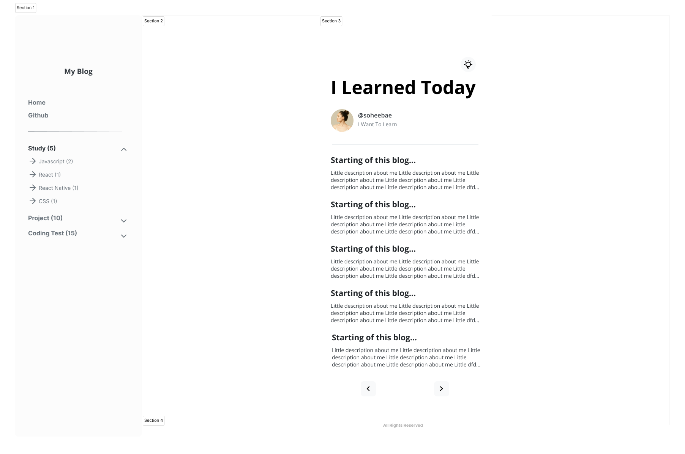
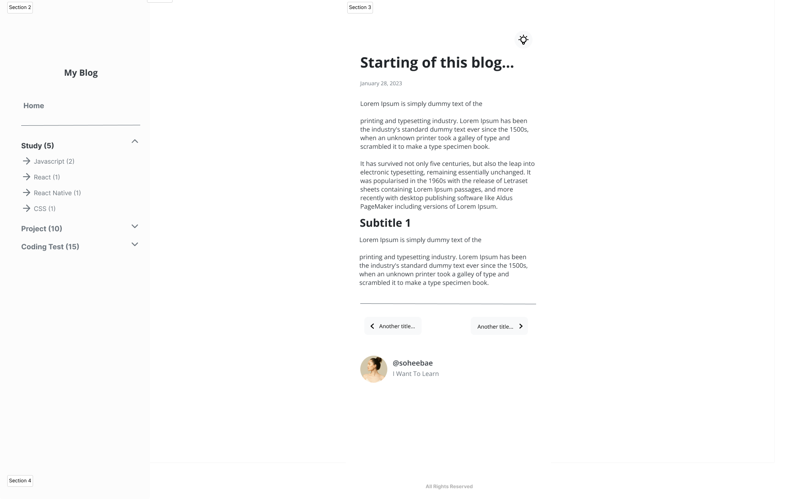

 

## 이 프로젝트를 시작하기 까지

 

## 프로젝트 상세 소개

### 💡 핵심기능

#### 1. 

#### 2.

#### 3. 

#### 4.

 

### 🎯 타겟유저

 

### 🧱 구조도

간단히 이 프로젝트의 파일 구조와 메뉴 구조도를 [whimsical.com](http://whimsical.com) 을 통해 정리해 보았습니다.

##### 파일 구조도

##### 메뉴 구조도

 

### 🎨 디자인

프로젝트 목표와 위의 기획 만큼 프론트엔드 개발자로 중요한게 디자인인데요. 이 프로젝트에서 Figma를 이용해서 디자인했습니다.

디자인을 할때 Responsive하게 사용할수 있는 웹 디자인에 중점을 두었고 깔끔하게 Black and White 테마를 사용했습니다.

 

##### 메인 페이지 + 목차

##### 게시글 디테일 페이지

 

### 🗓️ 개발 기간 & 일정

<b>[1주차]</b> 2023.01.03 - 01.10

- UX/UI 디자인
- 세부 기획

<b>[2주차]</b> 2023.01.10 - 01.17

- Initial Set up
- Atom과 Molecule 컴포넌트 개발
- Page 컴포넌트 개발 및 큰 레이아웃 스타일링

<b>[3주차]</b> 2023.01.17 - 01.24

- 페이지네이션 기능 구현
- 라이트모드 다크모드 기능 구현
- 목차 기능 구현

<b>[4주차]</b> 2023.01.24 - 01.31

- 기능추가 및 리팩토링

 
