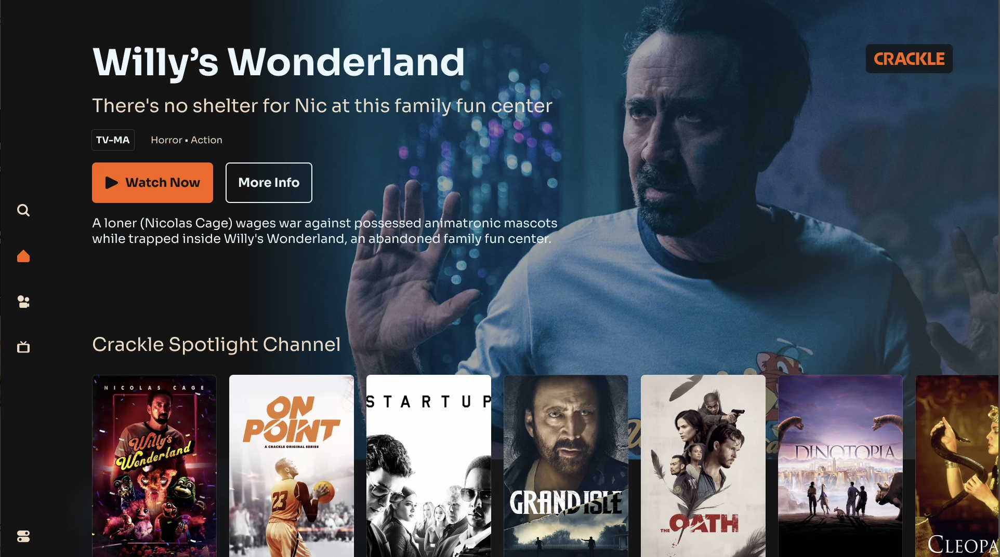

 

## 이 프로젝트를 시작하기 까지

이번 프로젝트에서 Frontend와 UI 쪽에 집중하여 개발하고자 하는 생각이 있었습니다. 한단계 천천히 배워가며 나아가고 싶었기에 이번 프로젝트에서 Backend까지 다 포함 시킨다는건 욕심이라고 생각했습니다. Frontend 개발, 디자인, 애니매이션에만 집중할수 있는 프로젝트가 어떤것들이 있을까 고민을 하다가 영화 데이터 불러오기 및 영화 검색 기능을 쉽게 구현할수있는 TMDB Api를 생각하게 되었습니다. 

 

## 프로젝트 상세 소개

### 💡 핵심기능

이번 프로젝트에서 영화 정보를 보여주는 기능이 제일 기본적인 기능이지만 그 외에도 다른 

#### 1. 영화를 카테고리화해 추천해주고 보여주는 기능

#### 2. TMDB를 통한 회원가입 및 로그인

#### 3. 영화 찾아보기 기능

#### 4. 자세한 영화 정보 보기 및 비슷한 영화 추천

#### 5. 유저들이 원하는 영화 리스트를 보관하고 저장할수 있는 서비스

 

### 🎯 타겟유저

영화의 자세한 정보를 제공하는 서비스를 목표로 하고 있습니다. 영화에 관심이 많거나 원하는 영화 리스트를 저장하는 서비스가 필요한 사용자를 위한 서비스 입니다.

 

### 🧱 구조도

간단히 이 프로젝트의 파일 구조와 메뉴 구조도를 [whimsical.com](http://whimsical.com) 을 통해 정리해 보았습니다.

##### 파일 구조도

 

### 🎨 디자인

이번 프로젝트에서는 현재 미국에서 운영되고 있는 한 영화 서비스 웹사이트 디자인을 참고하게 되었습니다. 웹사이트의 전체적인 Theme 색부터 큰 layout과 디테일한 디자인을 참고했고 조금 더 나은 사용자 경험을 위해서 컴포넌트에 간단한 hover 또는 dropdown animation를 추가하였습니다. 

 

##### 메인 페이지 

##### 영화 디테일 페이지

 

### 🗓️ 개발 기간 & 일정

<b>[1주차]</b> 2023.02.09 - 02.12

- Initial Set up
  - Prettier과 eslint 추가 
  - global scss file 추가 
    - breakpoint.scss
    - colors.scss
    - global.scss
    - mixins.scss
    - size.scss
    - typography.scss
- Atom과 Molecule 컴포넌트 개발
- Footer과 Navbar 컴포넌트 개발 및 큰 레이아웃 스타일링

<b>[2주차]</b> 2023.02.12 - 01.14
- 홈페이지 개발 
  - TMDB를 활용한 data fetching set up
  - Category 기준으로 나뉜 영화 리스트
  - Carousel 애니매이션 추가 및 영화 카드 컴포넌트 스타일링과 애니매이션 추가

<b>[3주차]</b> 2023.01.17 - 01.24

<b>[4주차]</b> 2023.01.24 - 01.31

 