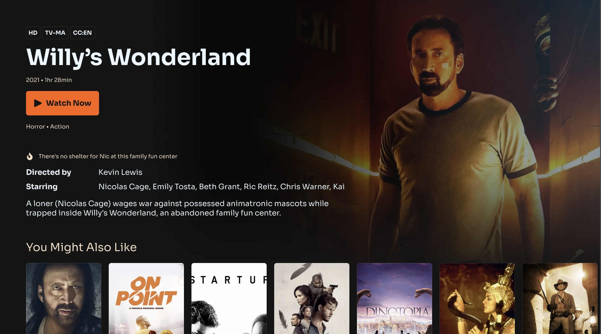

 

## 이 프로젝트를 시작하기 까지

한단계 천천히 배워가며 나아가고 싶었기에 이번 프로젝트에서 Backend까지 다 포함 시킨다는건 욕심이라고 생각하고 오직 Frontend 개발에 집중할수 있는 프로젝트가 어떤 것들이 있을까 고민하던 와중 오픈 API를 생각하게 되었습니다. 그중 제일 많이 알려지고 많은 개발자들에게 무난히 사용되고 있는 TMDB API에 대한 궁금증이 있었기에 이 프로젝트를 통해 알아보게 되었습니다.

> 💡 <b>TMDB API란?</b> : TMDB에서 제공하는 데이터를 불러와서 사용할수 있게 해주는 오픈 API중 하나입니다. TMDB API 서비스가 제공하는 데이터는 각종 영화, tv 프로그램 정보가 있습니다.

TMDB API에서 제공되는 서비스들이 다양하지만 그 중 TMDB를 이용한 로그인 또는 회원가입 서비스와 영화 리스트 category화해서 불러오기, 영화 검색 기능, 자동으로 업데이트되는 최신순 또는 인기순의 영화 데이터들이 제가 개발하고자 하는 기능들과 적합했기에 TMDB API를 이용하여 프로젝트를 진행하였습니다.

 

## 프로젝트 상세 소개

### 💡 핵심기능

이번 프로젝트에서 영화 정보를 보여주는 기능이 제일 기본적인 기능이지만 그 외에도 다른 기능들을 추가해보았습니다.

#### 1. 영화를 카테고리화해 추천해주고 보여주는 기능

많은 영화 서비스들이 기본적으로 제공하는 기능중의 하나인 카테고리로 나뉜 영화 리스트를 보여주는 기능은 꼭 필요하다고 생각했습니다. 저도 한명의 사용자인만큼 영화들이 카테고리 기준으로 나뉘었을때 보다 원하는 영화를 찾기가 쉬웠기에 이 기능이 프로젝트에서 제일 큰 역할을 해줄것이라고 생각했습니다.

#### 2. 자세한 영화 정보 보기 및 비슷한 영화 추천

#### 3. 영화 찾아보기 기능

#### 4. 유저들이 원하는 영화 리스트를 보관하고 저장할수 있는 서비스

더 나은 사용자 경험을 위해 추가하고 싶었던 기능중의 하나인 watchlist 기능입니다. 책갈피나 찜과 같은 비슷한 기능으로 본인이 다시 한번 보고 싶은 영화들을 한눈에 확인 할수 있는 기능이 유용할 거라고 생각했습니다.

#### 5. TMDB를 통한 회원가입 및 로그인

watchlist라는 영화 리스트 보관 서비스를 개발 하고 싶었기에 로그인 또는 회원가입 기능이 필요하였습니다. 사용자의 로그인을 통해 그 유저가 기존에 보관 하고 있던 영화리스트를 불러오면서 watchlist라는 기능의 효율성을 높이고 싶었습니다.

 

### 🎯 타겟유저

영화의 자세한 정보를 제공하는 서비스를 목표로 하고 있습니다. 영화에 관심이 많거나 원하는 영화 리스트를 저장하는 서비스가 필요한 사용자를 위한 서비스 입니다.

 

### 🧱 구조도

간단히 이 프로젝트의 파일 구조와 메뉴 구조도를 [whimsical.com](http://whimsical.com) 을 통해 정리해 보았습니다.

##### 파일 구조도

 

### 🎨 디자인

이번 프로젝트에서는 현재 미국에서 운영되고 있는 한 영화 서비스 웹사이트 디자인을 참고하게 되었습니다. 웹사이트의 전체적인 Theme 색부터 큰 layout과 디테일한 디자인을 참고했고 조금 더 나은 사용자 경험을 위해서 컴포넌트에 hover 또는 dropdown animation를 추가하였습니다.

 

##### 메인 페이지

##### 영화 디테일 페이지

 

### 🗓️ 개발 기간 & 일정

<b>[Phase 1]</b> 2023.02.09 - 02.12

- Initial Set up
  - Prettier과 eslint 추가
  - global scss file 추가
    - breakpoint.scss
    - colors.scss
    - global.scss
    - mixins.scss
    - size.scss
    - typography.scss
- Atom과 Molecule 컴포넌트 개발
- Footer과 Navbar 컴포넌트 개발 및 큰 레이아웃 스타일링

<b>[Phase 2]</b> 2023.02.12 - 02.18

- 홈페이지 개발
  - TMDB를 활용한 data fetching
    - 메인 영화 정보
    - Category 기준으로 나뉜 영화 리스트
  - Carousel 애니매이션 추가 및 메인영화와 영화 카드 컴포넌트 스타일링과 애니매이션 추가

<b>[Phase 3]</b> 2023.02.18 - 02.24

- 카테고리화해서 영화 리스트 볼수 있는 페이지 개발
- 영화 디테일 페이지 개발
  - 비슷한 영화 추천 기능 추가

<b>[Phase 4]</b> 2023.02.24 - 02.28

- TMDB를 이용한 로그인 또는 회원가입 기능 구현 및 로그인 페이지 개발
- 검색 기능 구현 및 검색 페이지 개발
- 영화 리스트 보관함 "watchlist" 기능 구현 및 페이지 개발

<b>[Phase 5]</b> 2023.02.28 - 03.02

- 리팩토링 및 vercel을 이용한 deploy

 
