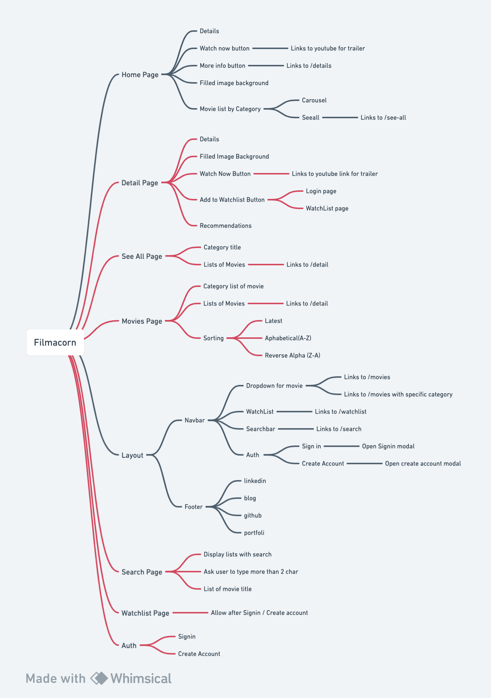

 

## 이 프로젝트를 시작하기 까지

Frontend 개발, 디자인, 애니매이션에만 집중할수 있는 프로젝트를 무엇이 있을까 고민을 하다가 영화 데이터 불러오기 및 영화 검색 기능을 쉽게 구현할수있는 TMDB Api가

 

## 프로젝트 상세 소개

### 💡 핵심기능

#### 1. 영화를 카테고리화해 추천해주고 보여주는 기능

#### 2. TMDB를 통한 회원가입 및 로그인

#### 3. 영화 찾아보기 기능

#### 4. 자세한 영화 정보 보기 및 비슷한 영화 추천

#### 5. 유저들이 원하는 영화 리스트를 보관하고 저장할수 있는 서비스

 

### 🎯 타겟유저

영화의 자세한 정보를 제공하는 서비스를 목표로 하고 있습니다. 영화에 관심이 많거나 원하는 영화 리스트를 저장하는 서비스가 필요한 사용자를 위한 서비스 입니다.

 

### 🧱 구조도

간단히 이 프로젝트의 파일 구조와 메뉴 구조도를 [whimsical.com](http://whimsical.com) 을 통해 정리해 보았습니다.

##### 파일 구조도

##### 메뉴 구조도

 

### 🎨 디자인

프로젝트 목표와 위의 기획 만큼 프론트엔드 개발자로 중요한게 디자인인데요. 이 프로젝트에서 Figma를 이용해서 디자인했습니다.

디자인을 할때 Responsive하게 사용할수 있는 웹 디자인에 중점을 두었고 깔끔하게 Black and White 테마를 사용했습니다.

 

##### 메인 페이지 + 목차

##### 게시글 디테일 페이지

 

### 🗓️ 개발 기간 & 일정

<b>[1주차]</b> 2023.01.03 - 01.10

<b>[2주차]</b> 2023.01.10 - 01.17

<b>[3주차]</b> 2023.01.17 - 01.24

<b>[4주차]</b> 2023.01.24 - 01.31

 
