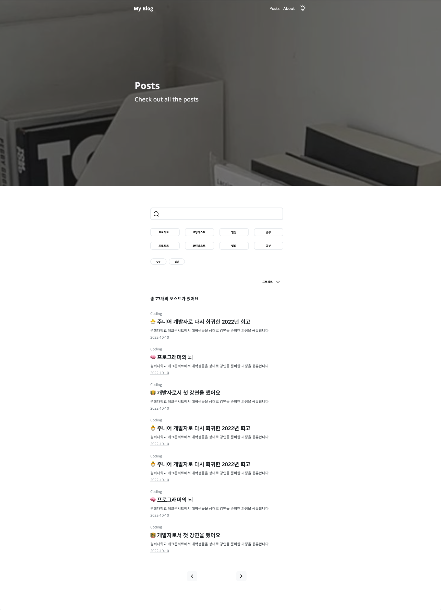
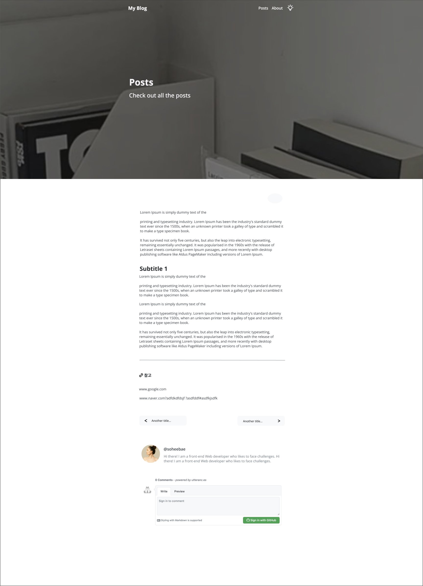

 

## Gatsby Blog Starter의 문제점과 V2로 업데이트하기 까지

Gatsby Blog Starter 개발이 끝난 이 시점 제가 막상 이 스타터를 쓰려고 하니 부족한 점들이 하나하나씩 보이기 시작했고 보안하고 싶은 것들을 모아서 V2로 프로젝트를 업데이트 하게 되었습니다.

#### 목차의 불편함

목차의 존재가 블로그의 기능성을 높여주는건 맞지만 디자인에서 불편함을 느꼈습니다. 목차가 모든 페이지의 왼쪽부분을 차지 했기에 반응형 레이아웃에 대한 신경을 많이 써야했고 메인 컨텐츠 공간이 애매해졌습니다. 이로 목차를 제거함과 동시에 상단 내비게이션 바를 사용하는게 더 좋은 결정이라고 생각했습니다.

#### 좀 더 많았으면 하는 formatter

Formatter을 늘림으로써 사용자가 원하는 블로그 게시글의 태그나 카테고리, 날짜등 보다 정확한 게시글의 정보를 알수 있었으면 좋겠다고 생각했습니다.

#### 개성있는 각각의 블로그 게시글

여기저기 참고 블로그들을 찾아보다가 제가 자주 쓰는 노션이 눈에 들어왔습니다. 노션에서는 페이지 상단마다 사용자가 아이콘을 넣고 배경화면을 넣을수 있는 시스템이 있는데요. 저도 이미지와 이모티콘을 위 배경화면에 넣음으로 각 페이지마다 조금 다르게 꾸밀수 있는 기능을 주면서 개성있게 만들수 있으면 어떨까 라는 생각을 하게 되었습니다.

#### Filtering과 Search 기능 추가

프로젝트 V1에 대한 회고를 하는 부분에서 추가하고 싶었던 기능중에 하나였던 블로그 게시글 filtering과 search 기능을 추가하여 조금더 블로그 실용성을 높이고 싶었습니다.

#### 애니매이션 추가

Hover을 하거나 스크린 스크롤을 할때 스타일에 어느정도의 애니매이션을 추가함으로써 블로그 탬플릿에 좀 더 생동감을 주고 싶었습니다.

 

## 프로젝트 상세 소개

### 🎨 디자인 계획

프로젝트를 V2로 업데이트 하면서 디자인에 큰 변화를 주었습니다. 대표적으로 왼쪽에 위치하고 있었던 목차 부분을 없애면서 블로그 전체 레이아웃에 큰 변화를 주었고 내비게이션 바를 추가해보았습니다. 또 모든 페이지 상단에 이미지 배경화면을 넣으면서 좀 더 깔끔한 UI에 집중할수 있게 바꾸어 보았습니다.

##### 메인 페이지

##### 게시글 메인 페이지

##### 게시글 디테일 페이지

 

### 🧱 구조도 계획

간단히 이 프로젝트의 파일 구조와 메뉴 구조도를 whimsical을 통해 정리해 보았습니다.

 

### 🖥️ 개인 프로젝트

프론트엔드 개발, 디자인, 기획

 

### 🔨 활용한 기술스택

Gatsby, Graphql, React, SCSS

 

## 프로젝트를 진행하면서

 

