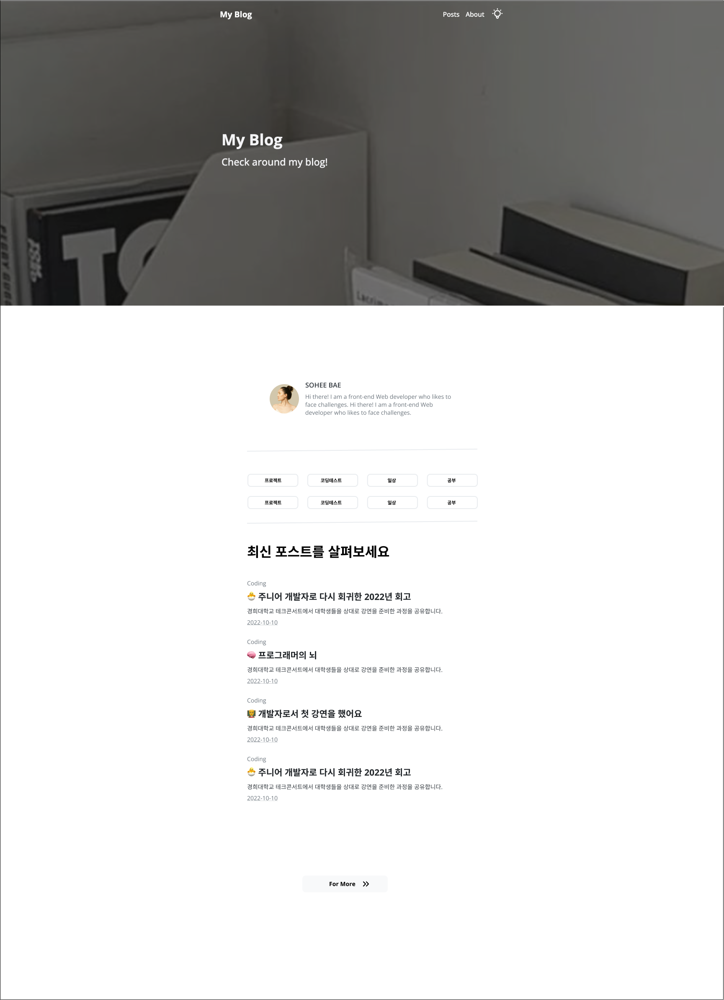
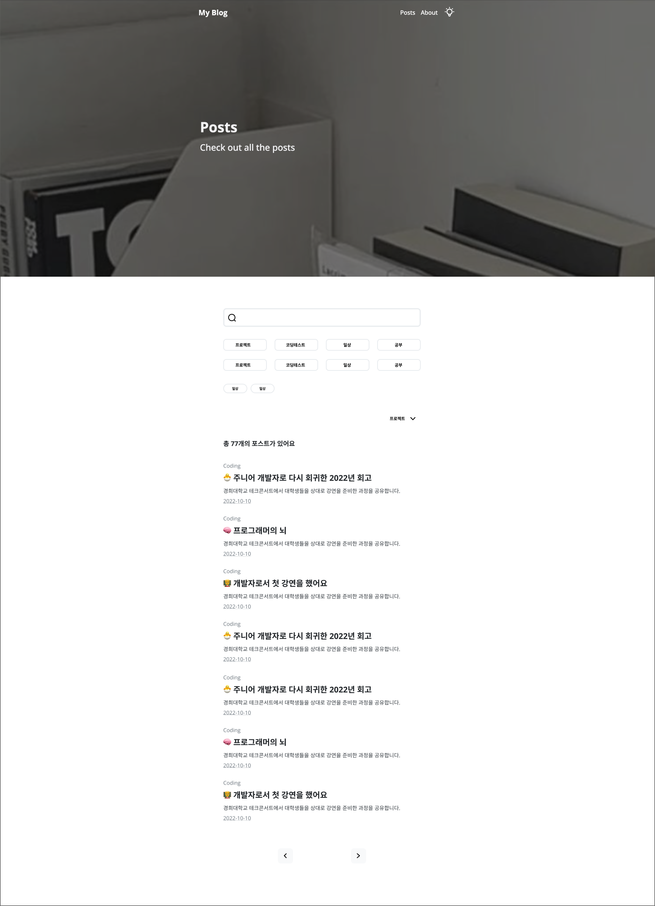
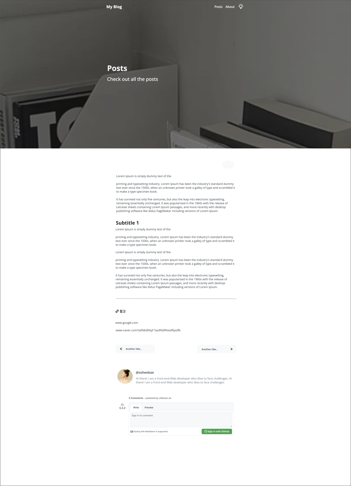
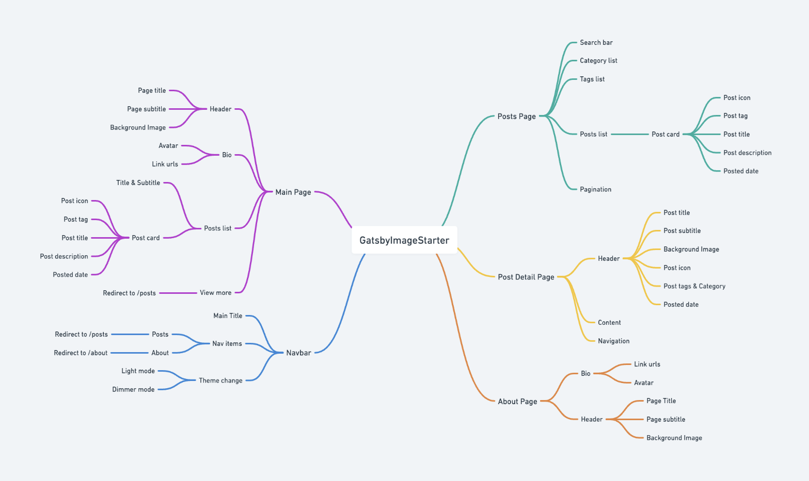

 

## Gatsby Blog Starter의 문제점과 V2로 업데이트하기 까지

Gatsby Blog Starter 개발이 끝난 이 시점 제가 막상 이 스타터를 쓰려고 하니 부족한 점들이 하나하나씩 보이기 시작했고 보안하고 싶은 점들을 모아서 V2로 프로젝트를 업데이트 하게 되었습니다.

#### 목차의 불편함

목차 기능이 이전 버전 프로젝트에서의 제일 핵심 기능이였기에 목차를 기준으로 블로그 디자인을 했었는데요. 그 결과로 블로그의 기능성을 높여 주는데에는 성공했지만 디자인에서는 불편함을 느꼈습니다. 목차가 모든 페이지의 왼쪽 부분을 차지 했기에 반응형 레이아웃에 대해 신경을 많이 써야함과 동시에 페이지의 오른쪽 부분을 차지하던 메인 컨텐츠 공간 활용도가 낮아졌습니다. 목차 기능에 대해 한번 더 생각하게 되었고 비슷한 역할을 할수 있는 기능이 어떤 것들이 있을까 하던 고민 끝에 목차를 제거함과 동시에 목차기능을 대신 해줄수 있는 filtering과 search 기능을 추가하며 업데이트를 진행 하기로 계획했습니다.

#### 특색없는 블로그

이전 버전의 블로그 탬플릿은 특색이 없다고 생각했습니다. 이 블로그 탬플릿의 제일 핵심은 커스터마이징 할수 있는 점이라고 생각하고 그만큼 사용자가 커스터마이징 할 수 있는 부분들이 다양해야 한다고 생각했습니다. UI를 중심으로 개선하기 위해 여기저기 참고 블로그들을 찾아보던중 제가 자주 사용하던 노션이라는 서비스가 눈에 들어오게 되었는데요. 노션에서는 페이지 상단마다 사용자가 아이콘을 넣고 배경화면을 넣을수 있는 시스템이 있습니다. 그 점이 마음에 들었고 제가 사용자에게 제공할수 있는 커스터마이징 옵션 중 하나라고 생각하게 되었습니다. Formatter의 수를 늘리면서 조금 더 다양한 데이터들로 페이지 상단부분을 채우고 각기 다른 이미지와 이모티콘을 각 페이지의 상단 부분에 넣음으로 모든 페이지가 조금씩은 다른 느낌을 주면 조금 더 개성있지 않을까 하는 기대감과 함께 계획하게 되었습니다.

#### 생동감 없는 블로그

위의 특색없는 블로그에서 더 나아가 이 블로그 템플릿뿐만이 아닌 모든 웹 서비스들이 생동감이 있으면 사용자 경험을 향상시킨다는 믿음이 있습니다. 생동감이 없던 이전 블로그 템플릿에서 조금 더 개선하여 페이지의 컴포넌트에 애니매이션을 추가해 사용자 경험을 높이고 싶었습니다.

 

## 프로젝트 상세 소개

### 🎨 디자인 계획

프로젝트를 V2로 업데이트 하면서 디자인에 큰 변화를 주었습니다. 대표적으로 왼쪽에 위치하고 있었던 목차 부분을 없애면서 블로그 전체 레이아웃에 큰 변화를 주었고 내비게이션 바를 추가해보았습니다. 또 모든 페이지 상단에 이미지 배경화면을 넣으면서 좀 더 깔끔한 UI에 집중할수 있게 바꾸어 보았습니다.

##### 메인 페이지

##### 게시글 메인 페이지

##### 게시글 디테일 페이지

 

### 🧱 구조도 계획

간단히 이 프로젝트의 파일 구조와 메뉴 구조도를 whimsical을 통해 정리해 보았습니다.

 

### 🖥️ 개인 프로젝트

프론트엔드 개발, 디자인, 기획

 

### 🔨 활용한 기술스택

Gatsby, Graphql, React, SCSS

 

## 프로젝트를 진행하면서

#### 프로젝트 페이지 구조 변화

기존에 

#### 프로젝트 전체 UI 업데이트

- 게시글 디테일 페이지 디자인
- 게시글 리스트 디자인
- 상단 이미지를 이용한 홈페이지와 게시글 페이지

#### Filtering과 Search 기능 추가

프로젝트 V1에 대한 회고를 하는 부분에서 추가하고 싶었던 기능중에 하나였던 블로그 게시글 filtering과 search 기능을 추가하여 조금더 블로그 실용성을 높이고 싶었습니다.

#### 애니매이션 추가

Hover을 하거나 스크린 스크롤을 할때 스타일에 어느정도의 애니매이션을 추가함으로써 블로그 탬플릿에 좀 더 생동감을 주고 싶었습니다.

 

