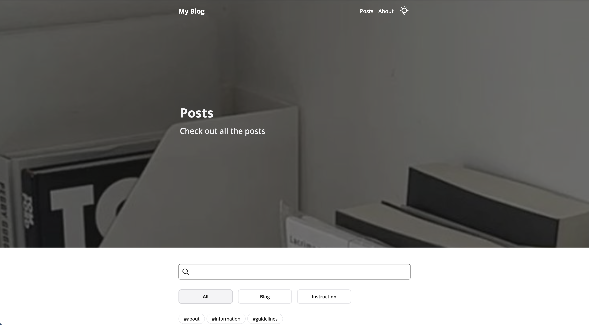
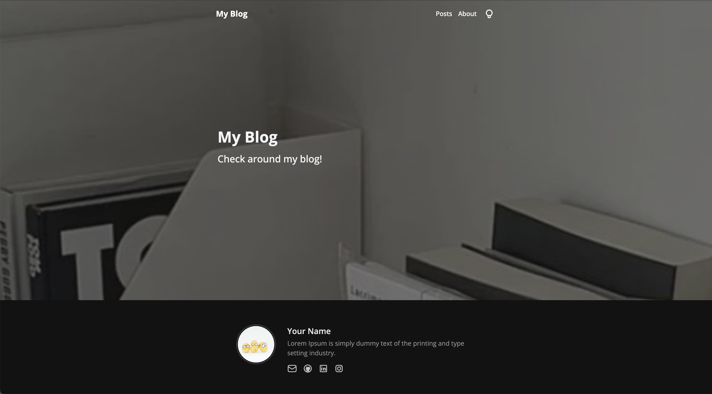
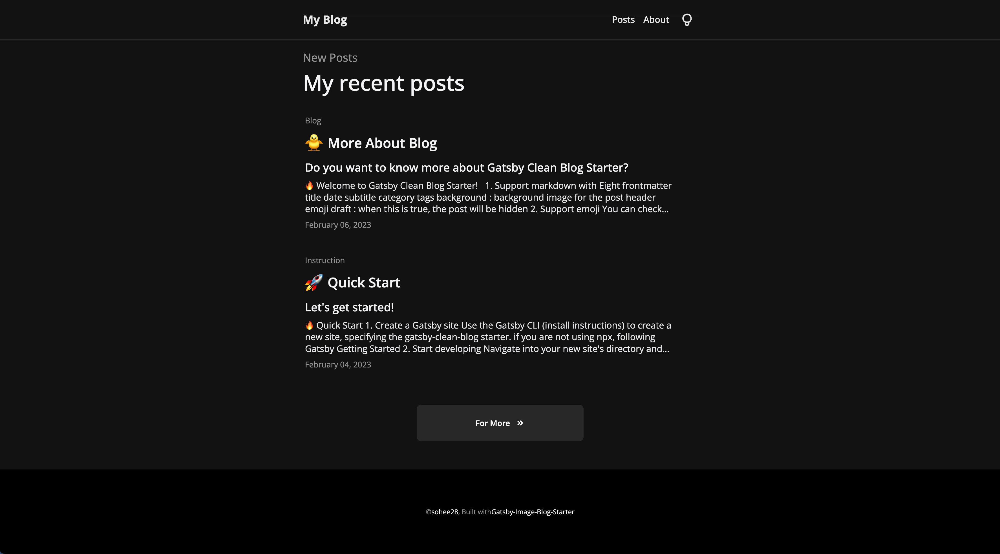
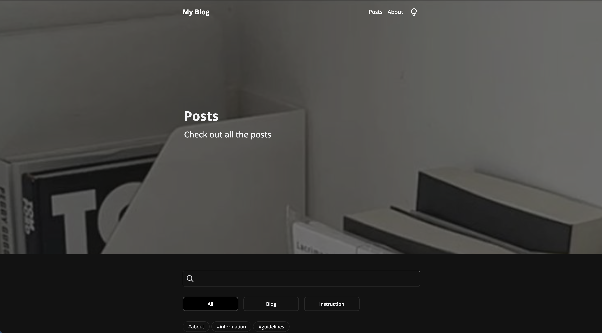

 

##### 라이트 모드

##### 다크 모드

 

### 프로젝트 결과물

🔗 Github : https://github.com/soheee-bae/Gatsby-Image-Blog-Starter

🚀 Demo : https://gatsbyimageblogstartermain.gatsbyjs.io/

 

### 업데이트 또는 추가한 기능

- 내비게이션 바
- 게시글 디테일 페이지 디자인
- 게시글 Filtering과 Search 기능
- hover과 스크린 스크롤에 대한 애니매이션
- 게시글 리스트 디자인

 

### 프로젝트를 끝내고

업데이트후의 디자인, 기능들이 훨씬 깔끔하고 사용자들이 보다 더 편하게 쓸수 있을것 같다는 생각에 업데이트 하길 잘 했다고 생각이 됩니다. 이번 업데이트는 많은 기능을 추가한건 아니지만 디자인을 전보

 

### 기억에 남는 구현

업데이트 하는 과정중 제일 신경썼던 부분은 게시글 filtering과 search 기능이였습니다. 목차 기능을 제거하면서 게시글들을 카테고리와 태그로 나눌수 있는 기능의 필요성을 느꼈고 filtering과 search 기능을 추가했습니다. 

 

### 가장 고민했던 부분

 

### 어려웠던 점

 

### 보안 하고 싶은 부분

 

### 추가 하고 싶은 기능

- utterances를 이용한 댓글 기능
- 참고 창

 

### 무엇을 배웠고 어떤 부분이 성장했나?

