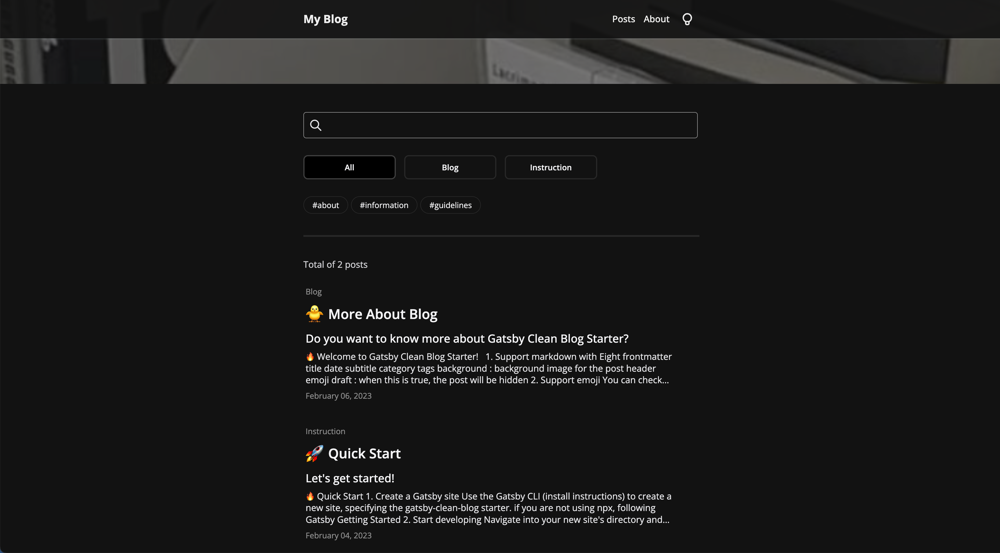

<br/>

## 프로젝트 결과물

🔗 Github : https://github.com/soheee-bae/Gatsby-Image-Blog-Starter

🚀 Demo : https://gatsbyimageblogstartermain.gatsbyjs.io/

<br/>

<div style="position:relative; width:100%; margin:auto; text-align:center;">

<div style="float:left; width:48%; margin:auto; text-align:center;">


</div>

<div style="float:right; width:48%; margin:auto; text-align:center;">


</div>

<div style="float:left; width:48%; margin:auto; text-align:center;">


</div>

<div style="float:right; width:48%; margin:auto; text-align:center;">


</div>

</div>

<div style="float:left; width:100%; margin:auto; text-align:center;">

##### 라이트 모드

</div>

<div style="position:relative; width:100%; margin:auto; text-align:center;">

<div style="float:left; width:48%; margin:auto; text-align:center;">


</div>

<div style="float:right; width:48%; margin:auto; text-align:center;">


</div>

<div style="float:left; width:48%; margin:auto; text-align:center;">


</div>

<div style="float:right; width:48%; margin:auto; text-align:center;">



</div>

</div>

<div style="float:left; width:100%; margin:auto; text-align:center;">

##### 다크 모드

</div>

<div style="float:left; width:100%; margin:auto;">

<br/>

## 프로젝트를 끝내고

개인 프로젝트를 하면서 한번도 프로젝트에 대한 불편한 점들과 보안했으면 하는 기능들을 모아 Version 2로 업데이트를 해본 경험이 없었기에 이번 업데이트 과정이 조금 더 새롭고 흥미로웠던 것 같습니다. 업데이트 후의 디자인, 기능들이 전과 크게 비교되고 훨씬 더 깔끔하고 사용자들이 보다 더 편하게 쓸 수 있을것 같다는 생각에 업데이트 하길 잘 했다고 생각이 됩니다. 이번 업데이트는 사용자가 블로그 게시글 마다 각각의 개성을 담아 꾸밀 수 있게 만드는것에 중점을 두었고 저 또한 그 사용자중 한명이 될 것입니다.

</br>

### 💭 기억에 남는 구현

<b>Filtering과 Search 기능</b>

이전 버전의 프로젝트에서 제일 많은 신경을 썼었던 기능은 목차 기능이였는데요. 이번 업데이트 과정중 단순히 목차 기능을 제거하는것 보단 조금 더 실용성있고 활용도가 높은 대체 기능을 구현하고 싶었습니다. 고민끝에 나온 결정은 게시글 filtering과 search 기능 추가였습니다. 사용자들이 조금 더 쉽게 찾고자하는 게시글을 찾거나 게시글들을 카테고리 또는 태그를 기준으로 필터링 할수 있는 기능을 구현하는게 좋겠다고 생각했습니다. 이전 버전의 목차와는 다르게 graphql을 사용해서 파일 구조를 파악해 자동으로 목차를 만들기 보단 사용자가 게시글을 작성할때 마다 frontmatter중 하나인 `category` 또는 `tags`에 직접 입력해 그 기준으로 filtering 할수 있게 만들었습니다.

Filtering과 search 기능을 구현하기 위해선 다양한 방법들이 있겠지만 저는 `query-string`이라는 라이브러리를 이용해 카테고리나 태그들이 선택 될때마다 값을 페이지 `url`에 넣어서 값을 확인한 다음 필터링을 했고 조금 더 깔끔하고 다른 컴포넌트나 페이지들에서도 선택된 값들을 불러 올수 있게 `ContextApi`를 사용해 하나의 `hook`으로 만들어서 정리하였습니다.

> category로 "프로젝트", tag로 "blog, r3f, webgl"들이 선택 되었을때의 url : /posts/?category=프로젝트&tag=blog&tag=r3f&tag=webgl

```
import qs from "query-string";

const { category, tag } = qs.parse(search);
```

</br>

### 💭 가장 고민했던 부분

디자인에 중점을 두어 업데이트를 했던 만큼 새로운 디자인을 구현하는데 많은 시간을 썼습니다. 목차부분을 제거 하겠다는 결정과 동시에 블로그 전체 레이아웃에 큰 UI 변경을 해주어야 했고 제가 원하던 각각의 개성있는 블로그 게시글 페이지를 만들기 위해선 frontmatter들의 수가 이전 버전보다 더 많아야 했습니다. Frontmatter의 수를 늘리면서 고민하게 된건 주어진 frontmatter들을 모두 다 활용해서 어떻게 한 페이지에 깔끔하게 다 보여질수 있을까 였는데요.

<br/>

### 💭 어려웠던 점

</br>

### 💭 추가 하고 싶은 기능

#### utterances를 이용한 댓글 기능

다른 개발자나 사용자들이 블로그에 방문을 했을때 글을 읽고 댓글을 남길수 있다면 블로그가 소통의 창구가 되는 동시에 더 실용적일꺼라고 생각합니다.

#### 참고 창

글쓴이가 글을 작성했을때 사용했던 링크들을 한곳에 모아 놓을수 있는곳이 있다면 글쓴이 본인 뿐만 아니라 글을 읽는 사람들에게도 크게 도움이 될 것 같습니다.

</br>

### 💭 무엇을 배웠고 어떤 부분이 성장했나?

</div>

<br/>
