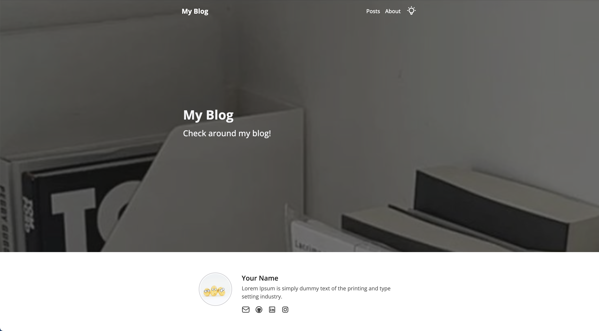

 

## 프로젝트 결과물

🔗 Github : https://github.com/soheee-bae/Gatsby-Image-Blog-Starter

🚀 Demo : https://gatsbyimageblogstartermain.gatsbyjs.io/

 

##### 라이트 모드

##### 다크 모드

 

### 🚩 업데이트 또는 추가 목적으로 구현한 기능

- 내비게이션 바
- 프로젝트 전체 UI
- 게시글 디테일 페이지 디자인
- 상단 이미지를 이용한 홈페이지와 게시글 페이지
- 게시글 Filtering과 Search 기능
- hover과 스크린 스크롤에 대한 애니매이션
- 게시글 리스트 디자인

 

## 프로젝트를 끝내고

업데이트후의 디자인, 기능들이 훨씬 깔끔하고 사용자들이 보다 더 편하게 쓸 수 있을것 같다는 생각에 업데이트 하길 잘 했다고 생각이 됩니다. 이번 업데이트는 사용자가 블로그 게시글 마다 각각 개성있게 꾸밀수 있음을 가능하게 만드는것에 중점을 두었습니다.

 

### 기억에 남는 구현

업데이트 하는 과정중 제일 신경썼던 부분은 게시글 filtering과 search 기능이였습니다. 목차 기능을 제거하면서 게시글들을 카테고리와 태그로 나눌수 있는 기능의 필요성을 느꼈습니다. 이전 목차와 다르게 graphql을 사용해서 파일 구조를 파악해 자동으로 목차를 만들기 보단 사용자가 게시글을 작성할때 마다 하나의 `frontmatter`로 카테고리를 넣게끔 만들어 카테고리를 filtering 할수 있게 만들었습니다.

 

### 가장 고민했던 부분

 

### 어려웠던 점

디자인에 중점을 두어 업데이트를 했던 만큼 새로운 디자인을 구현하는데 많은 시간을 썼습니다. 목차를 제거함과 동시에

 

### 추가 하고 싶은 기능

#### utterances를 이용한 댓글 기능

다른 개발자나 사용자들이 블로그에 방문을 했을때 글을 읽고 댓글을 남길수 있다면 블로그가 소통의 창구가 되는 동시에 더 실용적일꺼라고 생각합니다.

#### 참고 창

글쓴이가 글을 작성했을때 사용했던 링크들을 한곳에 모아 놓을수 있는곳이 있다면 글쓴이 본인 뿐만 아니라 글을 읽는 사람들에게도 크게 도움이 될것같습니다.

 

### 무엇을 배웠고 어떤 부분이 성장했나?

 
