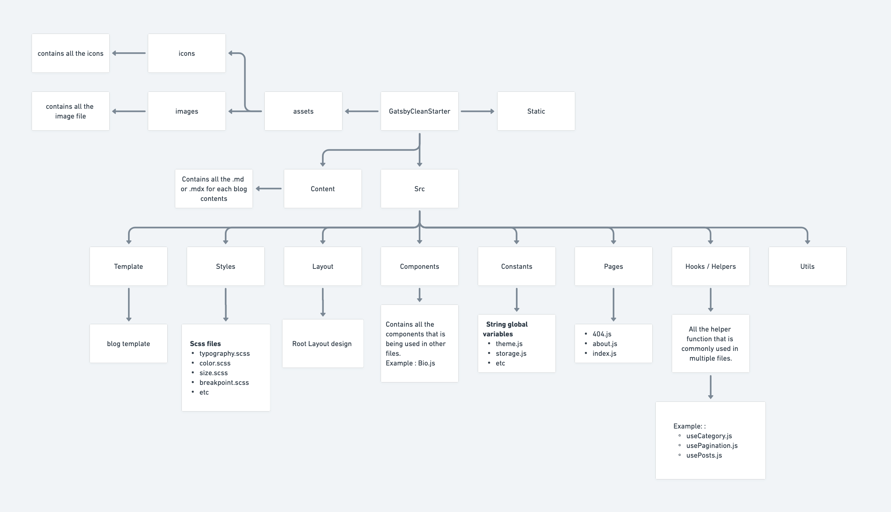
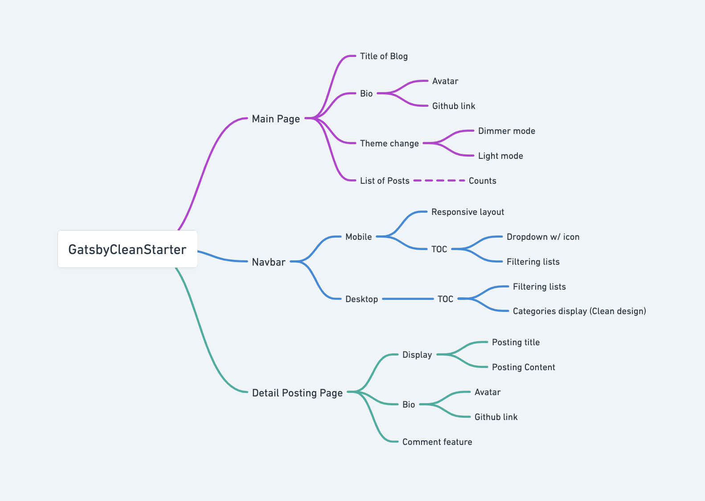
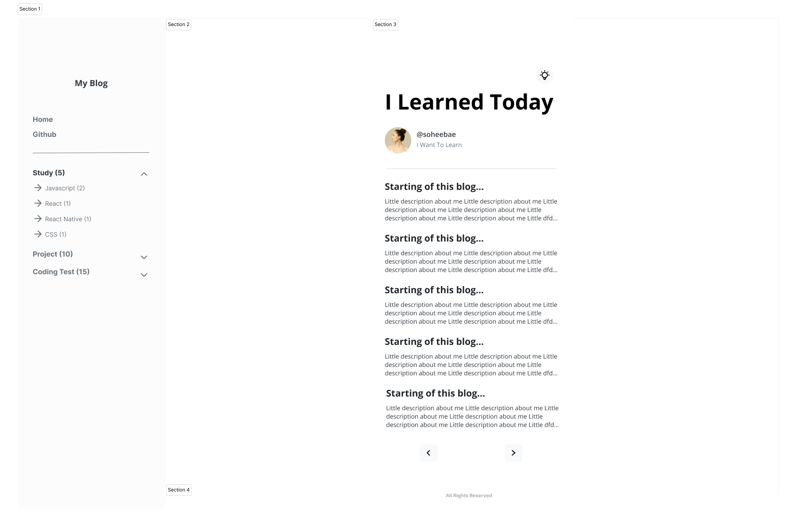
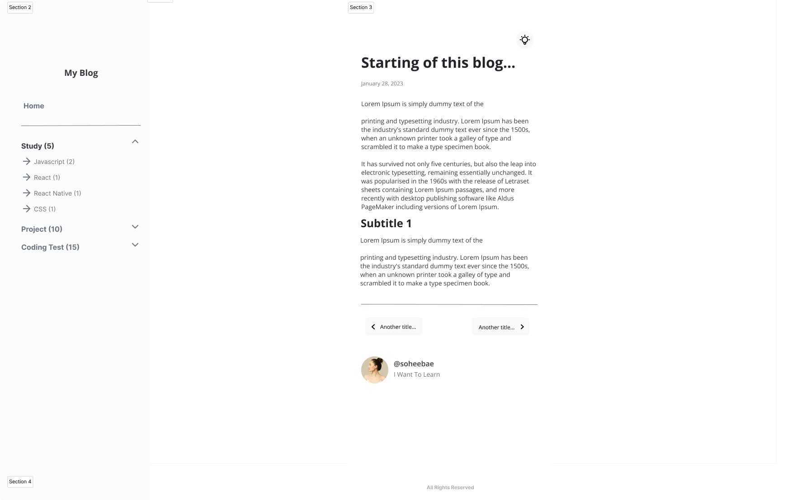

 

## 이 프로젝트를 시작하기 까지

많은 개발자들이 Github Page를 통해 개발 블로그를 시작하거나 현재 운영을 하고 있고 새로운 지식을 배우는 과정에서 기록의 중요성과 필요성을 느낀 저는 이 프로젝트를 시작하게 되었습니다. 많은 사람들이 사용하고 있는 Gatsby인 만큼 온라인에는 벌써 많은 블로그 스타터들이 있었지만 스타터 그 자체를 만드는 것 또한 하나의 배움이라고 생각해서 직접 만들기로 결정을 했습니다.

큰 욕심없이 이 프로젝트를 통해서 다른 사용자들에게 좀더 다양한 스타터 선택지를 주고 싶다는 생각과 더불어 오픈 소스로 만듬으로써 제가 만든 템플릿과 디자인들을 다른 개발자들에게도 보여 줄수 있는 기회를 만들고 싶었습니다.

이 프로젝트가 저에게 좀더 특별한 이유는 리액트만 주구장창 고집했었던 제가 한번도 접하지 않았었던 Gatsby를 제일 핵심 프레임워크로 사용한다는 점과 Graphql이라는 쿼리 언어를 사용할거라는 점이 였습니다. 두분야에 전혀 지식이 없는 저에겐 큰 도전이자 배움일것입니다.

 

## 프로젝트 상세 소개

### 💡 핵심기능

블로그에도 다양한 종류와 디자인이 있지만 저는 이런 핵심기능들에 중점을 두었습니다.

#### 1. 파일구조를 이용한 한눈에 보이는 목차

블로그 게시글을 만들때 마다 md 파일에 카테고리를 직접 입력하기 보단 자동으로 파일구조를 파악해 카테고리화해서 목차를 보여줄수 있는기능이 있다면 좋을것 같았습니다.

#### 2. 라이트모드와 다크모드

여기저기 찾아보다 많은 블로그들이 라이트모드와 다크모드 기능을 가지고 있는것을 확인할수 있었습니다. 많은 블로그에 이 기능이 있다는건 그만큼 사용자들이 선호 하는 기능이라고 생각했고 제가 한번도 개발 해보지 않았던 기능이였기에 이 기회를 통해서 한번 해보는것도 좋을것 같다는 생각을 했습니다.

#### 3. Pagination

블로그에서 중요한 기능중이 하나인 `pagination` 기능을 꼭 추가 하고싶었습니다. 게시글 수가 많아질수록 더 유용한 기능인데요. 게시글 수에 상관없이 블로그 디자인이 깔끔했으면 좋았기에 Pagination이 큰 역할을 해줄것이라고 생각했습니다.

#### 4. 커스터마이징

다른 개발자들이 사용할수 있는 블로그 스타터인 만큼 쉽게 스타일을 커스터마이징 할수 있는 기능이 필요하다고 생각했습니다.

 

### 🎯 타겟유저

- Github page와 Gatsby를 사용해 개발 블로그를 시작하거나 운영하고 싶은 개발자들
- Gatsby를 이용한 블로그를 운영하고 싶은 사람들

 

### 🧱 구조도

간단히 이 프로젝트의 파일 구조와 메뉴 구조도를 [whimsical.com](http://whimsical.com) 을 통해 정리해 보았습니다.

##### 파일 구조도

##### 메뉴 구조도

 

### 🎨 디자인

프로젝트 목표와 위의 기획 만큼 프론트엔드 개발자로 중요한게 디자인인데요. 이 프로젝트에서 Figma를 이용해서 디자인했습니다.

디자인을 할때 Responsive하게 사용할수 있는 웹 디자인에 중점을 두었고 깔끔하게 Black and White 테마를 사용했습니다.

 

##### 메인 페이지 + 목차

##### 게시글 디테일 페이지

 

### 🗓️ 개발 기간 & 일정

<b>[1주차]</b> 2023.01.03 - 01.10

- UX/UI 디자인
- 세부 기획

<b>[2주차]</b> 2023.01.10 - 01.17

- Initial Set up
- Atom과 Molecule 컴포넌트 개발
- Page 컴포넌트 개발 및 큰 레이아웃 스타일링

<b>[3주차]</b> 2023.01.17 - 01.24

- 페이지네이션 기능 구현
- 라이트모드 다크모드 기능 구현
- 목차 기능 구현

<b>[4주차]</b> 2023.01.24 - 01.31

- 기능추가 및 리팩토링

 
