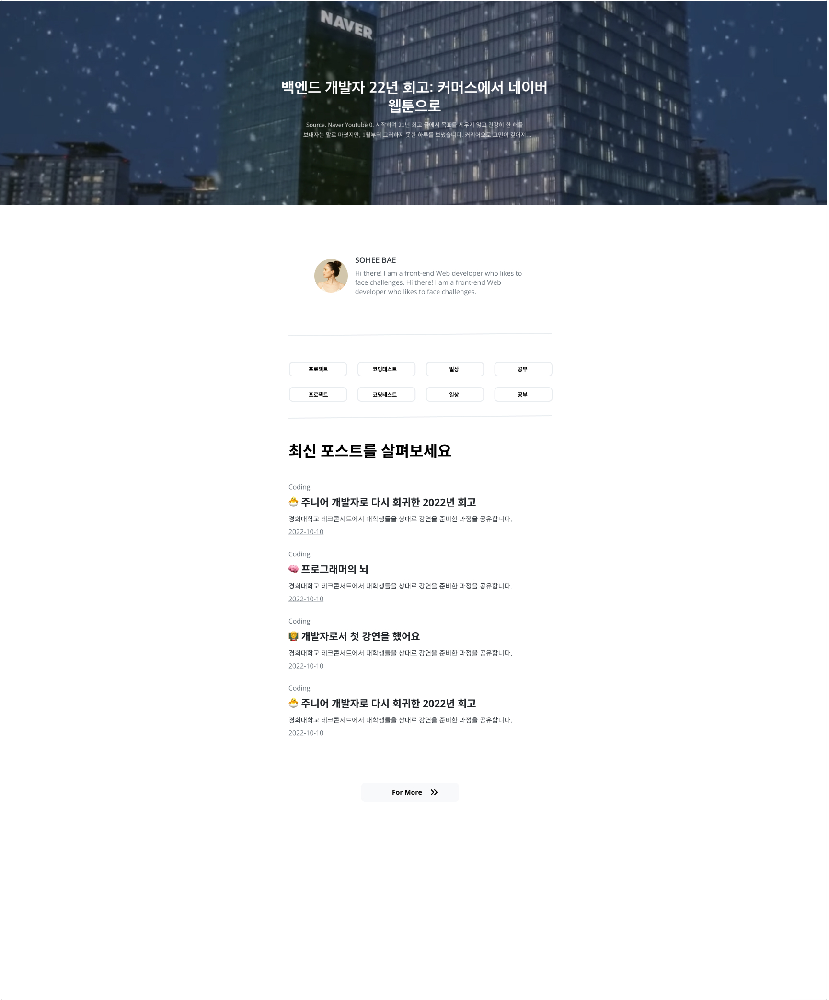

 

## 이 프로젝트를 시작하기 까지

Gatsby Blog Starter이 끝난 이 시점 제가 막상 이 스타터를 쓰려고 하니 부족한 점들이 하나하나씩 보이기 시작했고 고치고 싶은 점들이 생겼습니다.

#### 목차의 불편함

- 목차가 페이지 왼쪽에 위치함으로써 물론 기능성으론 좋겠지만 디자인에서 조금 불편함을 느꼈습니다. 스크린 사이즈에 따라 많은 디자인 레이아웃을 바꿔줘야 한다는 점과 모든 페이지의 왼쪽엔 목차가 차지 함으로 메인 컨텐츠 공간이 애매했습니다.

#### 좀 더 많았으면 하는 formatter

- Formatter을 늘림으로써 사용자가 원하는 블로그 게시글의 태그나 카테고리, 날짜등 보다 정확한 게시글의 정보를 알수 있었으면 좋겠다고 생각했습니다.

#### 이미지를 활용한 블로그 탬플릿

- 여기저기 참고 블로그들을 찾아보다가 제가 자주 쓰는 노션이 눈에 들어왔습니다. 노션에서는 페이지마다 사용자가 아이콘을 넣고 배경화면을 넣을수 있는 시스템이 있는데요. 저도 이미지와 이모트콘을 위 배경화면에 넣음으로 각 페이지마다 조금 다르게 꾸밀수 있는 기능을 주면 어떨까 라는 생각이 있었습니다.

#### Filtering과 Search 기능

- 프로젝트 v1에 대한 회고를 하는 부분에서 추가하고 싶었던 기능중에 하나였던 블로그 게시글 filtering과 search 기능을 추가하여 조금더 블로그 실용성을 높이고 싶었습니다.

 

## 프로젝트 상세 소개

 

### 🎨 디자인

##### 메인 페이지

##### 게시글 메인 페이지

##### 게시글 디테일 페이지

