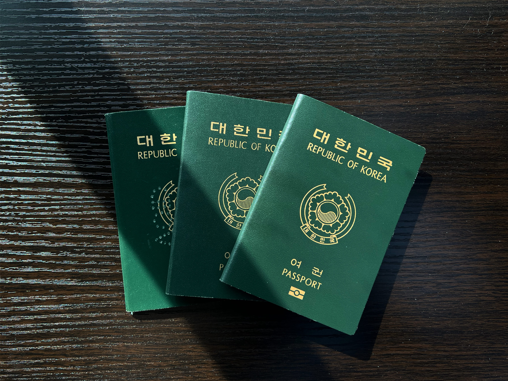
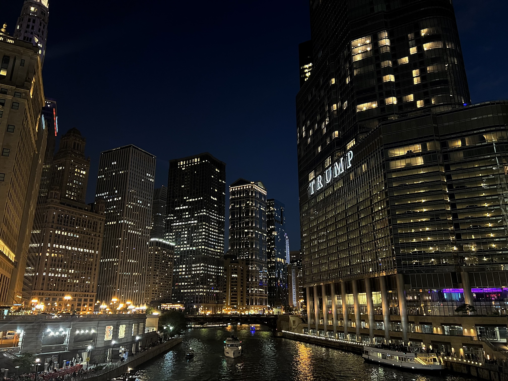
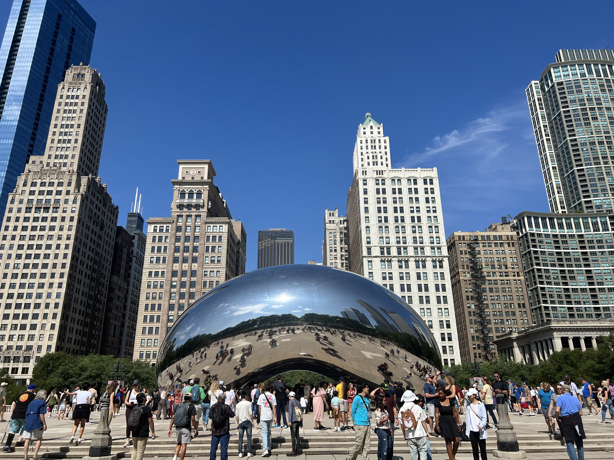
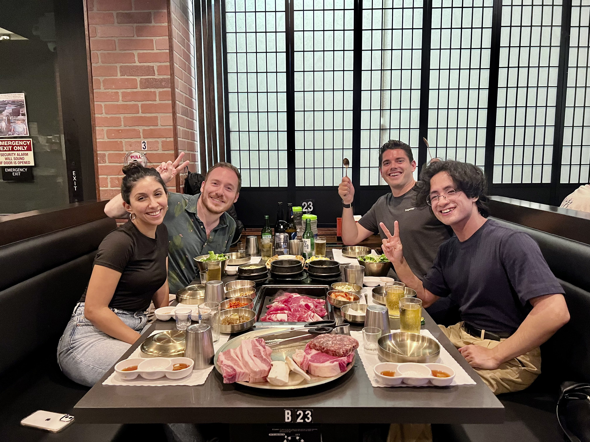
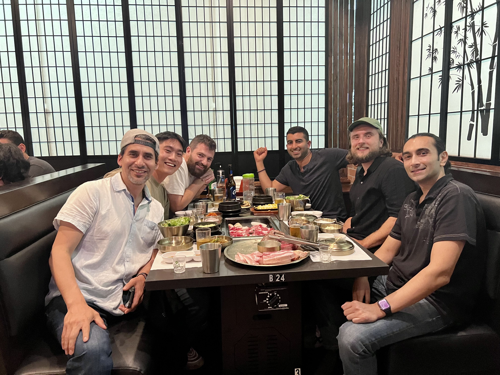
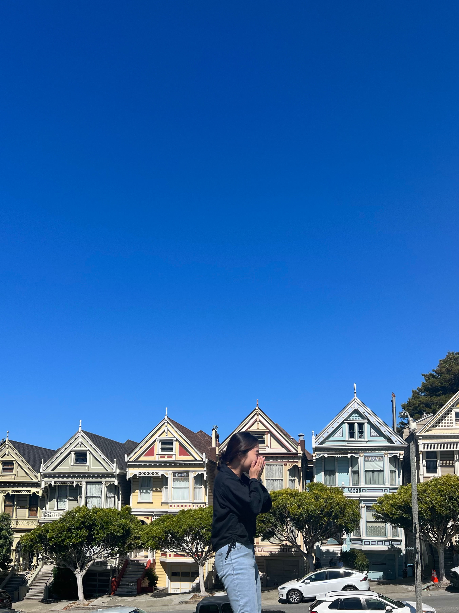
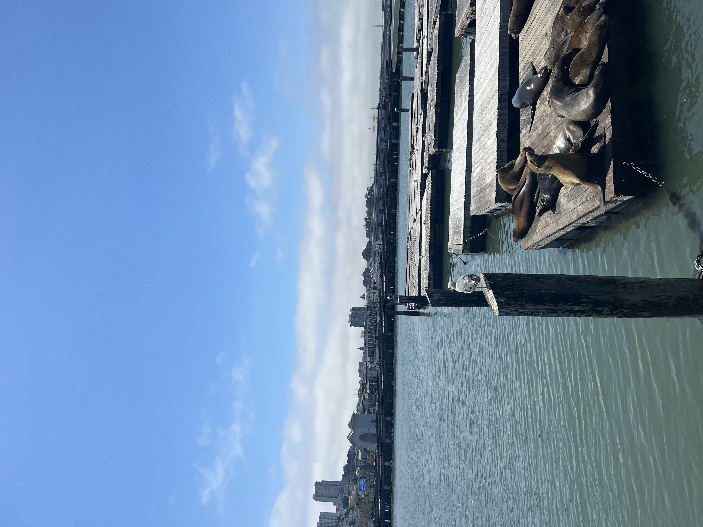
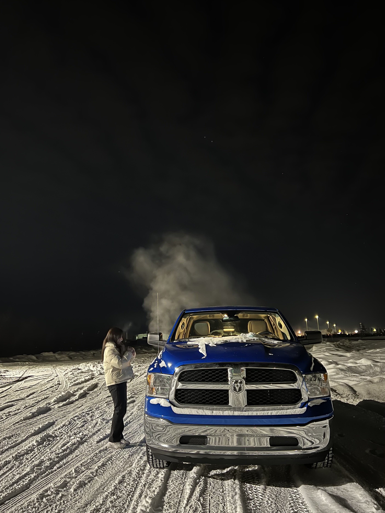
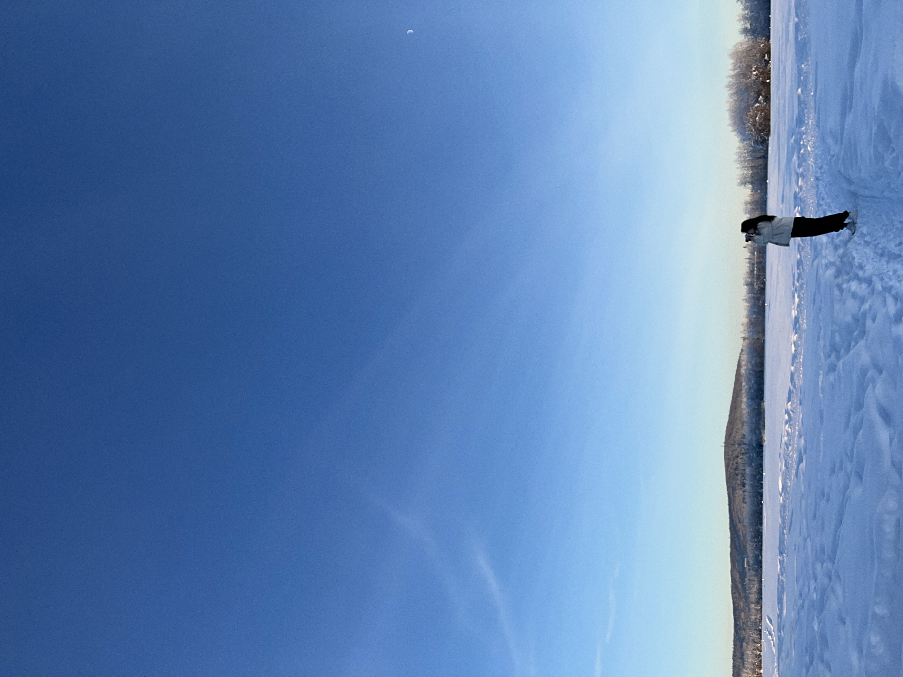
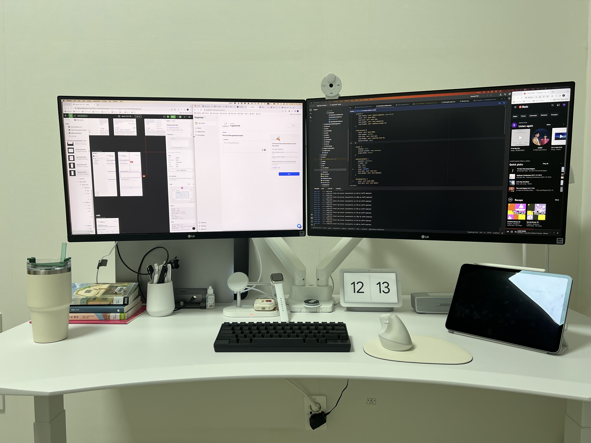

2023년도는 내가 살아온 그 어느 해보다 많은 변화를 맞이하고 적응하기에 바빳고 하루하루를 허투르게 보내지 않기위해 열심히 살았던 한해였다. 하루하루가 모자라다고 느껴질 만큼 매시간에 무언가를 하기위해 집중했고 그러다보니 일년이란 시간이 그 어느때보다 빠르게 지나가고 벌써 23년도의 끝을 보고 달리고 있다. 그 느낌을 잊지 않기 위해서 이렇게 글을 남겨본다.

 

### **한국귀국**

올해 내게 제일 큰 변화는 다름아닌 한국 귀국이였다. 다른 해보다 올해에 큰 의미를 둔 이유중 제일 큰 이유이기도 하다. 남들이 생각하는 한국 귀국은 별 큰 의미가 없을수 있지만 나에겐 단순한 한국 귀국이 아닌 장장 14년이라는 유학 생활을 마무리한 후의 한국 정착이였기에 조금 더 의미를 둔 듯하다. 인생의 반을 타지에서 보내고 살아온 나에겐 큰 다짐이자 그에 따른 변화들이 많고 클꺼라고 예상했기에 미리 계획을 하면서 올해 초 부터 계획들을 차차 진행했다. 14년이란 긴 시간을 몇달안에 다 정리하고 마무리짓기에는 턱없이 부족한 시간이였지만 출입국 서류, 이사, 차 처분, 한국 입사준비 등 하나하나 신경쓰면서 준비하다 보니 시간이 훌쩍 지나버렸고 어느새 한국 입국을 해야 할때가 다가왔었다. 워낙 어린나이부터 새로운 분야나 환경에 정착하거나 적응해본 경험이 많았던 나였기에 이 변화는 나에게 두려움보단 설렘과 좋은 긴장감을 줬다.

이걸 쓰고 있는 지금은 벌써 한국에 온지도 4개월이 지나고 5개월이 다 되어가는 시점이다. 생각보다 너무나도 잘 적응했고 지금 생활에 만족하면서 하나하나 못해본걸 해보며 살아가고 있다. 나에겐 조금은 더웠던 8월말에 입국해서 새로운 집과 동네에 적응하며 9월을 보냈고 가을을 맞이하며 10월과 11월이 빠르게 흘러갔다. 중간중간에 있었던 약속들, 가족여행과 추석 또는 크리스마스 같은 조금은 특별한 날들이 날 충분히 바쁘게 해줬었다.

많은게 바뀌었지만 모든게 좋은 바뀜이였다. 항상 방학을 맞이해 한달 또는 조금은 더 길게 한국에 방문했었을때에는 매일 아침 일어나서 제일 먼저 하던일은 출국까지 몇일 남았는지 계산하는것이였다. 남은 시간이 별로 안 남았다는 이유로 무언가에 쫒기듯이 약속을 잡고 사람들을 만나고 내가 하고 싶은거, 먹고 싶은걸 몰아서 했다면 지금은 그러지 않아도 된다는 여유가 생겼다. 또 항상 가족들을 원할때 마다 만날수 있다는게 크게 장점이자 달라진 점이다. 예전엔 시간, 거리와 이동 비용에 대한 부담이 너무 컸기에 1년에 한번 볼까말까 했던 가족들을 언제든지 원하면 만날수 있게 되었다. 이외에 많은 인프라가 집 근처에 있고 다양한 활동들과 여가생활을 할수있는 곳이 많은 한국에서 사니 삶의 질이 올라간게 느껴지는 요즘이다.

아직까지도 적응할게 많고 모르는게 많지만 시간이 지나면서 다 해결해주지 않을까.

 

### **버킷리스트였던 한달 여행과 그 외의 여행**

미국 생활 한지 8년이나 되었지만 항상 일하느라 공부하느라 바쁘고 돈이 없다는 이유로 미국 여행을 미루어 왔었다. 그래서 일까 내가 지내던 알래스카가 아닌 다른 주들을 여행해보고 싶다는 생각이 계속 쌓여갔었고 그것이 곧 내 버킷리스트로 자리잡았다. 한국 정착이 결정되고 나서 지금아니면 평생 못해볼꺼 같다는 생각에 미국 한달 여행을 계획하고 준비하게 되었다.

가고 싶은곳은 많았지만 다른 주 여행을 한번도 못 해본 나로썬 미국의 대표적인 도시들을 가는게 제일 좋은 결정이라고 생각했고 그 결과로 Chicago, LA, San Francisco로 결정되었다. 장소들이 결정되니 따른 것들은 빠르게 결정되었다. 항상 J의 성향을 가지고 디테일하게 여행 계획들을 해왔지만 이번엔 워낙 길기도 하고 재택근무로 일을 하면서 한달여행을 하는것이였기에 내가 지낼 장소, 교통, 비행기 티켓, 대략적인 스케줄, 가보고 싶은곳외에는 딱히 계획하지 않았다.

남들이 봤을땐 여자 혼자 여러주를 한달동안 여행하는게 위험하게 보이고 어떻게 하지 할수 있지만 오히려 그래서 더 해보고 싶었던것도 있는거 같다.

#### Chicago

여행 첫 도시였던 Chicago는 나에겐 정말 신기한 곳이였다. Chicago는 오묘하게 시골과 도시가 둘다 잘 어울려져 있는 곳이였기 때문이다. 멋진 건축물들이 도시 전체에 펼쳐져있고 그 사이에 커다란 숲이라고 할수있는 공원들과 대표 관광지인 큰 강이 흐르고 있었다. 낮에도 너무 이쁜 곳이지만 밤이 되면 모든 건물들의 빛이 강물에 반사되어서 더욱더 아름답게 빛났던 곳이다. 그 다리에서 뷰를 보며 한참을 멍때렸던거 같다. 일부러 야경을 보기 위해서 높은 타워에서 저녁식사를 한적이 있는데 시간이 어떻게 가는지 모를만큼 오랫동안 있었던 것 같다. Chicago는 뷰와 야경을 너무 좋아하는 나에게 완벽한 곳이였다.

##### Riverwalk

##### The Bean (Cloud Gate)

 

#### Los Angeles

여행 두번째 도시는 Los Angeles로 정했었다. 작년 한번 갔다왔던 나였지만 이번에는 회사 사람들과 만나기 위해서 간것도 있다. 일한지 벌써 2년이 되었지만 재택근무라는 이유만으로 화상통화로만 봐왔던 회사사람들이였기에 더욱더 기대되고 이번 여행이 더 설렜던 기억이 있다.
누군가를 화상통화로만 보고 알고 지낸다는것과 직접 만나보고 얘기를 한다는건 정말 다른 경험이였다. 카메라에서 비치는 모습, 일화는 모습 또는 미팅하는 모습 그 외에 사람다운 모습들을 많이 볼수 있었다. 
내가 얼마나 멋지고 대단한 사람들과 일을 하고 있는건지 스스로가 뿌듯하면서도 그 팀에 속할수 있는 사람이란게 행복했다. 이 회사에 들어오고 나서 많은게 바뀌었지만 제일 컸던건 회사의 크기, 성장과 무엇보다 엔지니어팀 자체의 멤버수와 체계적인 구조가 달라졌다. 
여기서 오랬동안 일하고 싶다는 생각도 있지만 많은 스펙을 가지고 있는 대부분의 팀원들 사이에서 잘 성장하고 많이 배워야겠다는 생각을 들게 해준 여행이였다. 

 

##### Sagetap 엔지니어팀 모임 in LA

 

#### San Francisco

한달여행의 마지막 도시이였던 San Francisco는 자연과 어우러진 아주 예쁜 도시였다. 언덕길도 많고 어딜가나 넓은 뷰와 탁트인 장소들이 속을 시원하게 해주었다. 바다 근처에 있는 도시였기에 조금만 운전해서 가도 바다표범과 넓게 펼쳐진 바다를 볼수가 있었는데 그게 참 좋았던거 같다. San Francisco는 거의 대부분의 건물들이 낮게 지어져있었고 주변에 자연과 잘 어울어 져있어서 그런가 어딜가도 여유로운 느낌이였다. 많은 사람들이 들판이나 공원에 앉아서 본인들의 시간을 즐기고 웃고 떠드는 모습들과 버스킹하는 모습들 등 한국에서는 흔히 볼수 없는 장면들이 많이 보인 마지막 도시였다. 

 

### **Fairbanks 여행**

사실 페어뱅크스는 올해 초에 갔다온 곳이다. 알래스카를 떠나기 전에 오로라를 한번이라도 보고싶어서 떠난 곳이기도 하고 이 맘때쯤 많은 업무랑 번아웃에 의해 스트레스를 많이 받아 힘들어 했던 때이기도 했다. 솔직히 가서도 일을 아예 안한건 아니다. 저녁까지 일을 마치고 잠깐 나가서 밤에 운전하고 여기저기 들리면서 오로라를 기대하기도 했고 그 중 하루는 유명한 광광코스인 야외온천을 들리기도 했다. 비록 오로라는 못 봤지만 조금이나마 스트레스를 해소한거에 의미를 두고 만족했던 짦은 즉흥 여행이였다. 

 

### **회사 업무**

이 회사에도 들어와서 일하기 시작한지 벌써 2년차 아니 3년차를 보고 달려가고 있는 개발자이다. 2년반이 지나가는 지금 이 시점, 프론트 앤드 개발자는 매일 비슷하지만 조금씩은 다른 업무들을 하는 느낌이다. 우선 개발을 해야하는 feature이나 page들이 달라지거나 그마다 또 다른 디자인들이 주어지기에 조금씩은 다른 느낌이지만 크게 보면 프론트앤드개발자가 하는건 비슷비슷하다. 개발하거나 수정해야하는 업무와 함께 디자인이 주어지고 그에 맞게 코딩을 짜고 코딩 테스트를 거쳐 테스트를 해서 배포를 하는것.

하지만 올해는 지금까지 해온 그 어떤 업무보다 규모가 크고 복잡하고 어려운 업무들이 많이 주어진 한해였다. 올해초부터 중순까지 6개월이라는 길다면 길고 짧다면 짧은시간동안 백엔드 3명과 프론트엔드 4명으로 구성된 엔지니어팀이 총 동원해 플랫폼 전체를 업그레이드 및 개발과 마이그레이션 한 경험을 쌓았다. 팀원 모두 밤낮주말 할꺼없이 달려들어 일을 진행시켰고 그 결과로 계획했던 시간안에 모든 업무를 완성시키고 배포까지 성공 했었다.

버전 1은 많은 문제가 있었다. 우선 코드 자체가 전에 같이 일을 했었던 CTO의 코드로 깔려있어서 요즘 트렌드와는 거리가 먼 고전적인 코드 스타일을 고집해서 발전 가능성이 없었고 무엇보다 엄청 복잡해서 새로 입사하는 개발자들이 적응하기 힘들어했었다. 버전 2는 사용자 경험을 향상 시키기위해 시스템 플로우 자체를 보강시킨 뿐만 아니라 전체 디자인도 업데이트시켰다.

6개월이라는 시간동안 플랫폼의 품질이 향상 되기도 했지만 개인적으로 배운점도 너무 많다. 본격적인 개발 과정에서 새로운 기술과 도구들을 학습하고 적용하면서 아토믹 디자인 패턴을 활용한 컴포넌트 단위 개발과 페이지 단위 마이그레이션 개발 등 다양한 기술적 역량을 향상시켰고, 프로젝트 기획 과정 및 개발 초기단계에서 플랫폼 V2에서 사용하고자 하는 프레임워크나 라이브러리, 전체 프로젝트의 타임라인 및 업무를 나누는 과정에서 각 팀원마다 다양한 의견을 자유롭게 제시하고, 그 의견들을 취합하고 조율하며 협업의 중요성을 배웠다.

그냥 하루하루 일하는게 당연하고 흘러가는 시간이라고 생각할수도 있겠지만 나도 모르게 배우는게 많은 거 같다. 코드가 달라지는걸 스스로 느끼고 예전엔 하기 힘들고 시간이 오래걸렸던 업무도 이젠 무덤덤하게 받는걸 보면 많은게 달라졌다는건 확실하다.

### **자기계발**

올해는 정말 많은 시간을 자기계발에 쏟아부었다. 처음엔 한국에 가서 이직한다는 생각으로 하루의 반을 일을 하고 자기전까지 또 다른 하루의 반을 자기계발을 했다. 자기계발은 세가지로 나눴었는데 첫번째는 프로젝트 2-3개를 만들기였다. 내가 알던 또는 알지만 써보지 못했던 툴을 사용하고 조합해서 여러가지 웹사이트를 만듬으로써 많은 툴에 경험을 좀 더 높이고 할수 있는게 많았으면 하는게 첫번째였다. 두번째는 한국 취업 과정중에서 많이 중요하게 생각하는 코딩테스트였다. 미국이랑은 좀 다르게 한국 취업은 코딩테스트가 큰 부분을 차지한다는걸 알고 백준 코딩테스트를 천천히 하기로 마음먹고 해나갔다. 세번째는 개발블로그였다. 우선 영어로 코딩 자체를 배운 내가 한국어로 Tech에 대한 글을 쓴다는 것 자체가 나에겐 큰 의미가 있다고 생각했고 추후에 내가 공부했던 기록들을 돌아볼 곳들이 잇었으면 했다. 매일매일 똑같은 하루를 보내면서 포기하고 싶을 때도 많았고 그냥 사람 사는게 아닌것 같다고 느낄 때도 있었다. 아침 7시에 기상해서 8시부터 미팅을 하고 1시쯤에 점심을 먹고 5-6시쯤에 일이 끝나면 저녁먹고 자기전 새벽까지 자기계발을 했기 때문이다. 

### **마치며**
