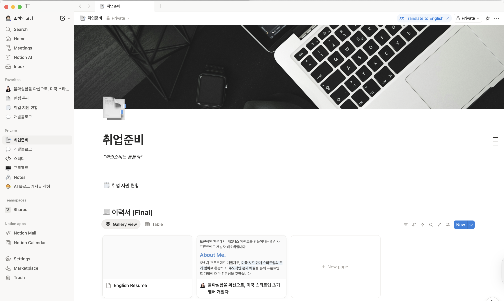
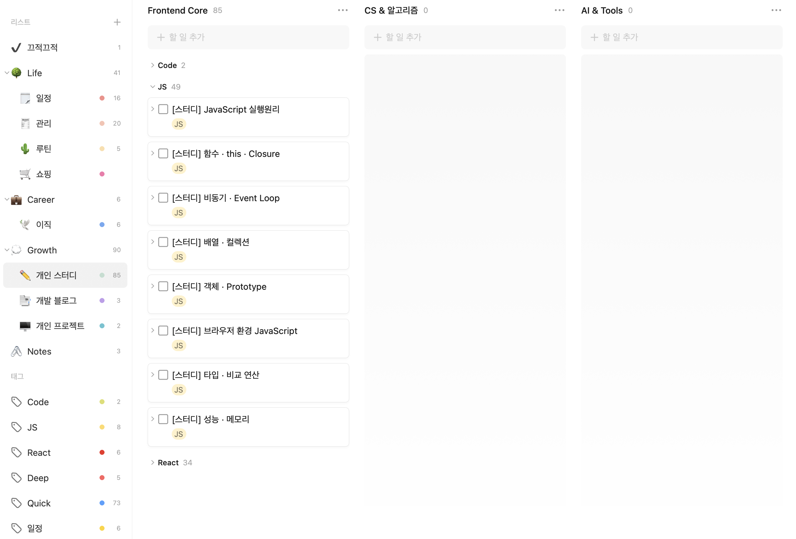
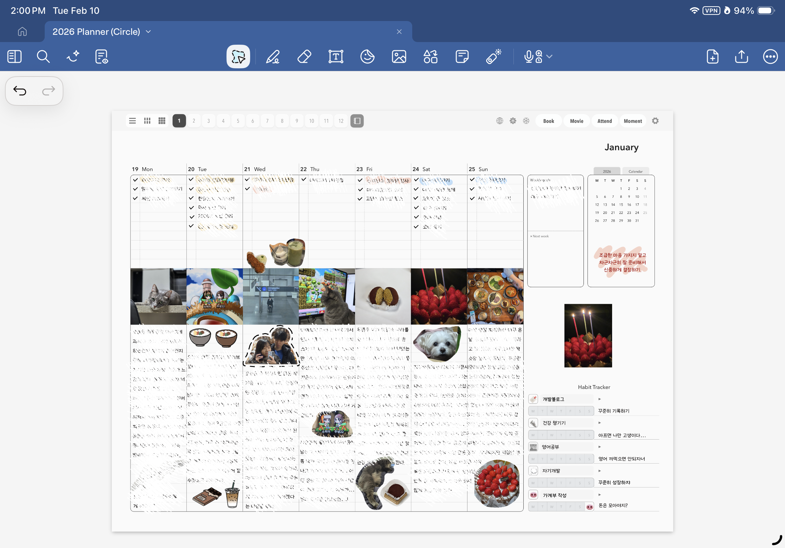
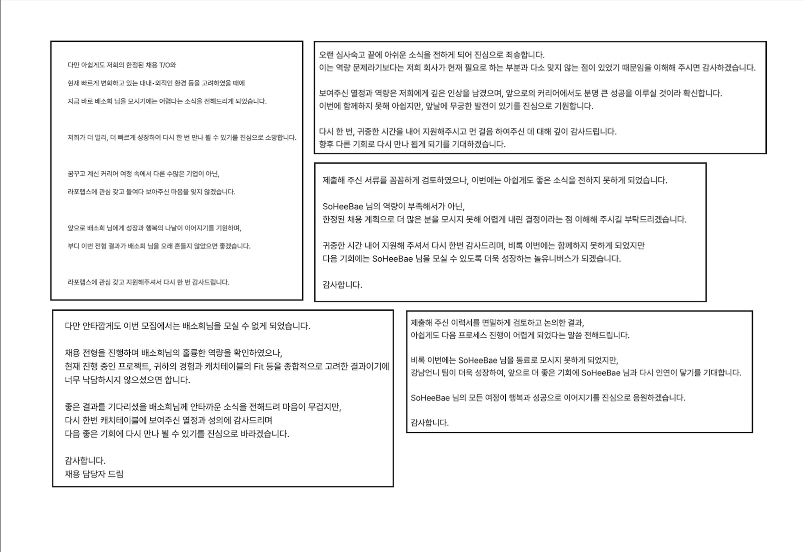
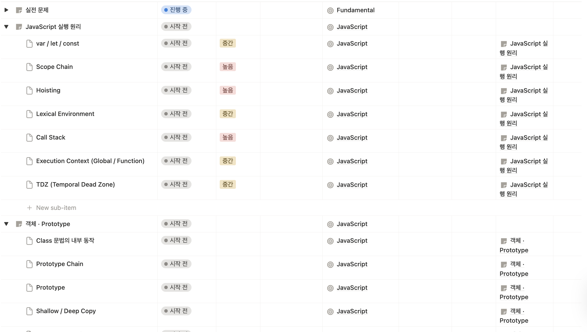

# 방향을 정하기 시작한 달

2024년과 2025년을 돌아보며 가장 많이 느낀 감정은 “아쉬움”이었다.
일상이 흘러가는 대로 살아가고, 그 안에서 멈춰 만족했던 나를 보며 이런 생각이 들었다.

조금 더 노력했다면 어땠을까.
조금 더 시간을 잘 활용했다면 지금은 달라져 있지 않았을까.

그 아쉬움이 2026년의 출발점이 되었다.

2026년의 시작은 생각보다 바빴다.

작년 12월이 이력서 작성, 포트폴리오 수정, 코딩 테스트 연습 등 ‘지원 전 준비 과정’이었다면, 1월은 본격적으로 원서를 제출하고 전형을 경험한 달이었다.

면접, 코딩 테스트, 사전 인터뷰, 과제를 병행하며 정신없이 시간이 흘렀다.

이직 준비와 별개로, 내 삶의 방향과 습관을 다시 점검하고 싶었다. 개발자로서의 성장뿐 아니라, 사람으로서도 단단해지고 싶었다.

 

## 기록과 시간 관리를 시작하다

2026년부터는 삶을 관리할 줄 아는 사람이 되고 싶다.

- Notion 정리
- TickTick 구조 정리
- GoodNotes 다이어리 작성 시작

그동안 Notion과 TickTick을 꾸준히 사용해왔지만, 올해는 조금 다르게 써보고 싶었다. 단순히 할 일을 체크하는 도구가 아니라, 내가 시간을 어떻게 쓰고 있는지 인식하는 도구로 활용하고 싶었다.

“바쁘다”는 말 대신,

“나는 지금 어디에 시간을 쓰고 있는가?”를 묻기 시작한 달이었다.

  

##### 나의 Notion

Notion은 내가 배우고 느낀 것들, 쌓이는 지식들, 그리고 그동안 기록해온 생각들을 정리하는 공간으로 정비했다. 흩어져 있던 정보들을 하나의 흐름으로 묶으면서, 내가 무엇을 알고 있고 무엇이 부족한지도 더 선명하게 보이기 시작했다.

##### 나의 TickTick

TickTick은 단순한 일정 관리가 아니라 ‘시간 배치’의 도구로 사용해보려 한다. 고정되어 있는 스케줄과 루틴 사이의 빈 시간에 공부나 자기계발을 자연스럽게 끼워 넣으며 하루를 조금 더 의도적으로 설계하려고 한다.

##### 나의 Goodnote 일기

그리고 굿노트 다이어리를 작성하기 시작했다. 한 달, 일주일, 하루 단위로 계획하고 기록하면서 하루를 돌아보는 시간을 만들었다. 내가 어떤 상황에서 집중력이 높은지, 어떤 패턴으로 시간을 소비하는지, 무엇을 할 때 에너지가 차오르는지. 기록을 통해 나를 더 잘 이해하고 싶었다.

나를 이해하게 되면, 조금 더 의도적으로 살아갈 수 있을 것 같았기 때문이다.

 

## 이직 준비를 하며 느낀 것들

1월 한 달 동안 여러 회사의 전형을 경험했다.

- 정말 다양한 회사가 존재한다는 것
- AI를 활용할 수 있는 엔지니어를 원하는 곳이 많다는 것
- 면접, 코테, 과제… 회사마다 결이 완전히 다르다는 것

특히 코딩 테스트와 면접을 보면서 많이 느꼈다.

- 알고리즘 기본기가 부족하다는 것
- JavaScript에 대해 “안다”와 “깊이 이해한다”는 다르다는 것
- React, Next.js도 실무는 했지만, 아직 부족한 부분이 있다는 것

매번 내 스스로가 아쉬웠지만, 동시에 명확해졌다. 내가 무엇이 부족한지 보이기 시작했다는 건 이제 채워야 할 방향이 보인다는 의미니까.

 

## 1월 말, 다시 기본기로

1월 말부터 기본기를 다시 정리하기 시작했다.

##### 기본기 공부를 위한 노션 테이블

아래 영역을 다시 다지기로 했다.

- JavaScript 기본기
- React 기본기
- Next.js
- TypeScript
- Fundamental (자료구조 및 가장 기본적인 알고리즘 문제 풀이)

프론트엔드 개발자가 공부해야 할 것은 끝이 없는것 같다. 하지만 그 모든 것을 쫓기게 되면 하나도 제대로 해낼수 없을거 같기에, 우선순위를 분명히 하기로 했다.

지금 나에게 가장 필요한 것은 JavaScript 기본기다. 겉으로 알고 있는 지식이 아니라, 왜 그렇게 동작하는지 설명할 수 있는 수준까지.

투두 리스트를 새로 정리했고, 이번 목표는 “많이”가 아니라 “깊이”다. 넓게 아는 개발자가 아니라, 구조를 이해하고 설명할 수 있는 개발자가 되고 싶다.

 

## 잠깐 멈췄던 시간들

1월을 앞만 보고 달리다 보니, 한 번은 하루 종일 아무것도 하기 싫고 멍한 날이 있었다.

예전의 나였다면 컨디션을 무시한 채 “더 달려야 한다”고 스스로를 밀어붙였을 것이다. 하지만 이번에는 좀 달랐던 것 같다.

그동안 기록해온 일정과 공부 로그를 보면서, 내가 왜 힘들었는지 이해할 수 있었다. 면접과 과제, 준비 과정이 겹치며 체력과 에너지가 바닥나 있었다. 스스로의 한계를 인지하고 인정하니 마음가짐이 달라졌다.

빨리 이직하고 싶은 마음은 여전하지만, 오히려 그럴수록 “쉬어야 할 때는 쉬는 게 맞다”는 걸 배웠다. 잠깐 멈추는 시간이 있어야 다시 집중할 수 있다는 것을 이번 달에 체감했다.

본가인 대구에 내려가 가족들과 시간을 보내며 생각을 정리했고, 1월 마지막 주는 면접을 잠시 멈추고 기본기 공부와 회복에 집중했다.

달리는 것도 중요하지만, 지속 가능하게 달리는 것이 더 중요하다는 걸 알게 된 한 달이었다.

 

## 마무리

1월은 결과의 달이 아니라, 방향을 정한 달이었다.

부족함을 인정했고, 기록을 시작했고, 기본기로 돌아가기로 했다.

2026년은 더 많이 하는 해가 아니라, 더 단단해지는 해가 되고 싶다.
